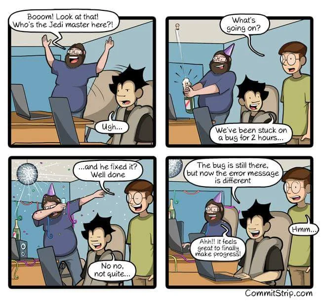

# Első lépések
Az oldal célja amikór kitaláltam, hogy készítek egy tudás megosztó felületet, ahol a programozás, algoritmusok, rendszerüzemeltetés, hálózatok működése és a mindennapi informatika területeit gyakorlatias úton mutatom be, mindezt elbeszéléses formában itt-ott szabad fogalmazással. A szakmai szóhasználatot megtartom, de igyekszem a lehető legközérthetőbben.

Úgy terveztem az oldal megalkotását, hogy minden témakör külön életet élő egységet képez, de nyilván az egymásra hivatkozások lesznek. Az oldal felépítését nem kötelező tartani. Sőt! Nem is tudlak végig kísérni mindenen. Csak az alapokat tudom neked megmutatni. A specifikusabb témákban már lehetséges, hogy külön fog válni az utunk, de ez nem baj. Mindenkinek más az erőssége és a gyengesége, más az a terület, amiben mélyebben elmerül.

> Ha már tudod, hogy mit keressel, akkor már meg fogod tudni találni.

De, ha még jelenleg az IT olyasminek tűnik, mint aki nem tudja, hogy kezdjen bele, akkor itt az oldalon megtalálod a kezdő lépéseket a neked tetsző szakirányban. Én azt tudom megmutatni, hogy hol van a start vonal, aztán már a te döntésed, hogy merre mész tovább. Persze addig azért jó sok témát érinteni fogunk. :wink: Ezért is úgy terveztem az oldalt, nem erőltetek egy nyelvet se rád, hanem párhuzamosan többet is fogok használni, de a későbbiekben ezt úgy is érinteni fogjuk. Aztán majd eldöntöd melyiket fogod használni később vagy melyikben mélyedsz el. (Vagy megtanulsz egyszerre többet is.)
Akkor is, miről fogok majd írni?

Eleve sok témát terveztem érinteni. A programozás vagy maga a program kód megértése alapvető követelmény az IT minden területén, így ez kihagyhatatlan. Vannak, akik eleve más fogott meg az IT-ban és inkább vagy az üzemeltetés, DevOps, hálózat, avagy a security irányba ment tovább.

> Nincs rossz döntés, csak döntés van! Csináld azt, ami megtetszik. :slightly_smiling_face:

## Nem én vagyok az egyetlen
Ez az oldal magyar nyelvű, de nem az egyetlen. Az internet tele van hasznos információkkal. Sőt! Szorgalmazom, hogy nézz más forrásból is, legyen az cikk, blog, YouTube és sorolhatnám. Nem én vagyok az egyetlen állat, aki belelő piszok sok időt, hogy ingyen megosszon valamit.

Mindezek ellenére ezen az oldalon vagy platformon, ha úgy tetszik:
- nem kell majd fizetni érte (azaz ingyenes)
- nem lesznek rajta hirdetések
- nem fogok adatokat gyűjteni rólad
- nem fogok eladni semmit
- nem kérek támogatást

Miért? Mert meg van a saját keresetem az IT területen. Az oldal csak egy hobbi, amit szeretek csinálni. Azért csinálom, hogy segítsek másoknak, akiknek szükségük lehet rá. Ha segítettem, akkor az már öröm számomra. Nyilván annyi negatívuma van, hogy nem főállásban szerkesztem csak, amikor ráérek.

Technikai oldalról nézve az oldal VitePress engine futtatja, ami ingyenesen használható (MIT license alatt). A GitHub Page pedig ingyenesen hostolja az oldalt. Maximum a domain név fizetős, de most évente az a ~20$ nem vág a földhöz.

Természetesen a személyes foglalkozás már más kérdés. Ha magántanárt keresel, akkor szerintem javasolni tudom a Programozók Facebook csoportot. Biztos lesz olyan személy aki szívesen segítene.

## Ki vagyok én?
Én ugyanolyan fejlesztő vagyok, mint Magyarországon a másik 10’000. Online inkább "Numichi" néven futok, de polgári néven [Csongor Donát](https://www.linkedin.com/in/donat-csongor/). Szakmámat tekintve Programtervező Informatikus és a Szegedi Tudományegyetemen végeztem 2017-ven. Továbbá etikus hacker akkreditációt is szereztem 2019-ben, bár e szakirányt a szakmai életemben nem használom. Emiatt is "Software Engineer"-ként hivatkozok magamra.

2021-ben oktató és mentor voltam a szegedi [FlowAcademy](https://flowacademy.hu/) bootcamp iskolában, ahol több kurzust is vittem. A témáim között volt a fejlesztői évfolyamokban a Spring Boot (Java alapú) keretrendszer, majd a DevOps évfolyamokban a [Kubernetes](https://kubernetes.io/)-t mutattam be a hallgatóknak.

## Nehéz szakma
Az informatika világa folyamatosan változik, ezért nélkülözhetetlen, hogy az IT szakemberek naprakészek maradjanak a legújabb technológiában és módszertanokban. Ez azonban nem mindig egyszerű.

Másik nehézség, hogy az informatikában a géppel "kommunikálni" nem olyan, mint először elképzeli az ember. A gép csak is kizárólag azt csinálja, amire utasítjuk. Ezért előfordul az, hogy úgy hisszük, hogy jól csináltunk valamit, de még se az elvárt eredményt kapjuk egy elírás miatt vagy valamit kifelejtettünk a folyamatból. Ennek a problémának a megtalálása egy nagy projekt esetén akár több napba is telhet. Nem is véletlen, hogy az IT tele van mémekkel.

Magyarosan lefordítva:
> - Bumm! Nézd csak! Ki a Jedi mester itt!?
> - Uhh...
> - Mi folyik itt?
> - Két órája egy hibán dolgozunk...
> - ...és ő megoldotta? Szép munka.
> - Nem nem, nem egészen.
> - Még mindig hibás, de most már más a hiba üzenet.
> - Ahh!! Olyan jó érzés végre haladni.
> - Hmm.

## Merj hibázni!

Még a legtapasztaltabb szakemberekkel is előfordulhat, hogy egy félre értés vagy egy figyelmetlenség miatt hibát követnek el, és hosszú ideig nem mutatja meg magát, akár évekig. Ennek kiküszöbölése érdekében fejlesztési folyamatokat definiálnak, hogy minél több emberen menjen át a termék vagy aminek éppen kell (konfiguráció, kód, ...), annál kisebb a valószínűsége - de sose lesz 0% -, hogy átcsusszan valamilyen hiba. Aztán mégis megesik, hogy földbe áll egy szerver vagy a fél világ, mint a [CrowdStrike](https://telex.hu/kulfold/2024/07/19/informatikai-leallas-kieses-legitarsasag-bank-media-microsoft) esetében. Nagy a skála. Ha valami még is átcsusszan, az mindenkin múlott, aki a folyamatban részt vett. **Sose egy szereplős!** _(Jó... Kivéve, ha egyedül dolgozol, mert akkor te vagy az egyetlen szereplő.)_

Ha pedig új dolgot tanulsz, akkor az elején sok hibát fogsz elkövetni. Ez teljesen normális. Az informatika egy olyan szakma, ahol a hibák elkerülhetetlenek. Ez nem műtő asztal, ahol, ha orvos hibát vét veszik is elő műhibáért. Itt, ha látod, hogy valami nem megy legrosszabb esetben is tovább kísérletezel. Én a több éves tapasztalatommal is olyan balfasz vak tudok lenni, hogy egy egyszerű elírást nem veszek észre. Legutóbb, mikor ezt az oldalt akartam automatizálni, hogy automatikusan kitegye az új verziót, folyton elhalt a folyamat. Aztán kiderült, hogy a rossz mappára hivatkoztam. El is ment vele 3-4 óra...

> Minél többszőr futsz be abba a bizonyos fasz-erdőbe, annál jobban fogod ismerni azt, hogy hogyan kell azt csinálni vagy megoldani.

> [!IMPORTANT] Fontos!
> Merj hibázni és tanulj belőle!

> [!CAUTION] Vigyázz a jogi következményekre
> Persze a szándékos károkozás már más tészta. Azért azt ne gyakorold.

## Ami előre vissz
AAz informatika iránti **szenvedély** az egyik legerősebb motiváló tényező. Ha őszintén **érdekelnek** a technológiai újdonságok és az IT megoldások működése, az önmagában is elég lehet ahhoz, hogy napról napra újra-és-újra elővedd. Amikor egy konkrét **problémát szeretnél megoldani**, vagy **van egy célod**, amit el akarsz érni, az is erős hajtóerő tud lenni. Az ilyen kihívások ösztönözhetnek arra, hogy mélyebben elmerülj az adott technológiákban vagy módszertanokban, és felfedezd a szükséges megoldásokat.

Sajnos azt kell mondjam, ha azért tanulod ezt a szakmát, mert csak "jól fizet", akkor sajnos nem fogod élvezni. Gyorsan fogod várni az eredményt, de a sorozatos hibák során elfogod veszíteni az érdeklődésed és le fogod tenni. Persze fellángolások lehetnek, de ezt a szakmát szerelemből, hobbiból vagy érdeklődésből lehet csinálni. Eladhatod magad, egy jó dumával, de a csontvázak ki fognak hullani.

## Ne es ebbe a hibába!
Jellemző eset, hogy valaki valamit olvas internetről, kipróbálja a lépésről lépésre leírást és máris ő a Jani. Holott a másnak a tudását használta fel a saját céljai elérésére. Ez nem az emberünk tudása, ez más tudása. Mármint ahhoz kellet az szaktudás, hogy a lépésről-lépésre megíródjon. Persze, ezt nem vetem meg, mert valahol el kell kezdeni. Bár egy nagyon minimális tudás mellet, még nem látni azt, hogy mi mindent nem tud még az ember. Mivel nem látja, hogy mennyi mindent nem tud, addig nagy a pofája.

Erről született pár videó, [itt](https://www.youtube.com/watch?v=iZhvjvXopAE) és [itt](https://www.youtube.com/shorts/a1hqK9B0t6w).

Ugyanez a helyzet az önjelölt hackerekről. Megszereznek egy publikusan elérhető programot majd megnyomják a gombot. Aztán ők a "hackerek". Nem. Ők a program felhasználója. Erre a jelenségre van is egy kifejezés, hogy [Script kiddie](https://hu.wikipedia.org/wiki/Hacker#Script_kiddie)...

Ezért is fontos, hogy megértsd, hogy 1-1 dolog mögött mi zajlik. Emiatt is törekszek arra, hogy alulról építkezzünk, azaz értsük meg mi zajlik a motorháztető alatt és teremtsük meg az alapokat, amire utána azt húzol fel, amit akarsz.

## Amire szükséged lesz
Az IT elég változatos szakterületeket tartalmaz. Vannak olyan irányok, amihez papír kvázi nem kell, mert bárhol és bármikor megtanulható, de egyes specifikus területeken elengedhetetlen, mint pl. a információ biztonság területén. Ennek ellenére, azért már mindenből is lehet vizsgát tenni, de ezek jellemzően 1-2 évre szólnak, mert az IT azért tempósan változik és benne van a pakliban, hogy 1-2 év múlva már annyira megváltozik egy termék vagy szolgáltatás, hogy lehet újra tanulni vagy frissíteni a tudást. Ekkor nyilván az akkori tudásod - amit a papír igazol - , már nem is állja meg a helyét.

DE!

Ahhoz, hogy egyáltalán belefogj szükséges pár dolog:

### Angol nyelv
Ha az angol nem megy, ne keseredj el. Most lehet, hogy hideg zuhanyként fog érni a következő bekezdésem:

Igen. Az angol nyelv az informatika alfája és ómegája. Az angol nyelv az informatika nyelve és szakmai nyelve. Az, hogy magyarul van valami, az csak a lefordítások miatt van. Említettem már, hogy gyorsan változik az informatika világa? Nah, ugyan ilyen gyorsan változnak a dokumentációk és jelennek meg a szakirodalmi könyvek is angolul. Mire lefordítanák magyarra, addigra már elavul vagy nem is lesz releváns. Azaz nem lesz "up-to-date".

**Jó hír #1**: Ha nem is beszélsz szóban, első körben írni és olvasni bőven elegendő. Ha még az se megy, addig fordítsd le a szövegeket GPT-vel vagy Chrome böngészőben akár a teljes oldalt. Közben párhuzamosan kezdj el angol-lal ismerkedni. Minél többszőr használod, annál jobban fog menni. Kényszerítsd bele magad, hogy angolul nézed a dokumentációkat vagy a videókat. Az lesz a leghatékonyabb, ha magán tanár segítségével tanulsz. Azt meg itt találsz dögivel.

**Jó hír #2**: Magyarországon nem egy céggel találkoztam, ahol az angol nyelvet gyakorlatilag nem is használják. Bár az állás hirdetések tartalmazták, de se az interjún, se munka során aktívan nem használtuk. Minden is magyarul ment. Jó 1-2 dolog nem, de azok csak 1-1 mondatokban nyilvánulnak meg.

Persze van olyan cég is, ahol az egy csapat tagjai nem csak Magyarországról vannak, hanem külföldről is. Ilyenkor már elengedhetetlen az angol nyelv írásban és szóban is. De, sajnos ezt nem tudom kategorizálni multinacionális vállalatra és kkv-ra. Minden cég más és más. Kapaszkodj! Amin lepetéztem először, hogy a Magyar Telekomban mikor ott voltam és a [CTO](https://www.aarenson.hu/ceo-coo-cfo-cto-cio-mit-jelentenek-magyarul-ezek-a-roviditesek/) tartott meetinget angolul tolmács fordított magyarra! Azért ez elég durva, meg ritka is. :sweat_smile:

Továbbiakban jellemző lehet, hogy majd angol szavakat fogok használni magyar ragozással.

### Számítógép
Egy számítógép elengedhetetlen. Egy minimális konfigurációval már el lehet kezdeni. Ha nincs, akkor találj egy helyet, ahol van lehetőséged gyakorolni.

Nem, nem kell erőmű. Ha van 16GB RAM-od, már sínen vagy. Nem fogsz olyan programot írni, ami 16GB RAM-ot igényelne. Bár van rá esély, hogy egy hibás kód megeszi az egész géped. De akkor, lényegében bármekkora erőforrást se lenne elég.

[//]: # (TODO: linux)
Ha nem tudsz laptopot venni ~300.000Ft-ért, akkor javaslom vegyél egy Rasperry PI-t [ezt](https://malnapc.hu/raspberry-pi-5-official-kit-8-32gb) vagy [ezt](https://malnapc.hu/raspberry-pi-5-official-kit-8-32gb-black) és [micro-HDMI-HDMI](https://malnapc.hu/micro-hdmi-to-standard-hdmi-a-cable) kábellel (vagy más üzletből) és már csak monitor, egér és billentyűzet kell. Igaz, azon [Linux valamely disztribúciója](https://hu.wikipedia.org/wiki/Linux-disztrib%C3%BAci%C3%B3k_list%C3%A1ja) fog futni, de még is jobb, mint a semmi. De, ez esetben a Linux részt mindenképpen vedd előre. (Jelenleg még nincs kész, de majd dolgozok azon is.)

Nem, telefon nem lesz jó!

### Internet
Internet elérés azért kell, hogy telepítsd a szükséges programokat, olvasd a dokumentációkat, nézd a videókat, keress megoldásokat, stb. Ha csak telefonról
tudsz netet osztani, az is elegendő lehet, de figyelj a mobil net korlátjaira. Minden esetben érdemes egy stabil internet elérést biztosítani.

## Kérdésed lenne?
> [!IMPORTANT] Fontos
> Amit 10 perc alatt megtalálható valamilyen formában az interneten (angolul vagy magyarul), azt NE kérdezd meg. Biztos más is feltette már azt a kérdést vagy hasonlót. A közösség nem szívleli, ha olyan kérdéssel kell foglalkoznia, amire rákeresve is az első 5 találat között szerepel. Gyorsabban kapod meg a választ internetet feltúrva, mint vársz a válaszra (ha válaszolnak rá egyáltalán). Azokra a kérdésekre térj ki, amelyekre nem találtál választ, vagy amelyekre nem találtál megoldást.

Ha pedig kérdésed lenne, azt számos módon felteheted.
- írsz egy [GitHub Issue](https://github.com/numichi-dev/site/issues/new)-t (GitHub account szükséges)
- írsz egy [email](mailto:numichidev@proton.me)-t
- írsz egy üzenetet a [LinkedIn](https://www.linkedin.com/in/donat-csongor/) profilomon. (LinkedIn account szükséges, és Connect-et kell kezdeményezed)
- írsz egy közösségbe, pl. Facebook [Programozók](https://www.facebook.com/groups/408156912634809) csoportba
- írsz egy kérdést [StakcOverflow](https://stackoverflow.com/) oldalon, de angolul megy a kommunikáció
- vagy írhatsz a GhatGPT-nek vagy valamely alternatívájának, de a válaszát kritikusan kezeld és győződj meg róla, hogy a válasz helyes-e

Facebook-on is írhattok, de ott nem garantálom, hogy reagálni fogok.

> [!WARNING] Figyelem
> Ha célzottan nekem szeretnétek írni, akkor ez esetben tegyétek hozzá, hogy honnan jöttök, hogy be tudjam azonosítani, hogy miért írtok. (Pl. "Numichi.Dev oldalról jöttem")
