# Fejlesztői környezet

Először is az IDE (Integrated Developer Environment) értendő, mert magyarra fordítva ez annyit jelent, hogy „Integrált fejlesztői környezet”. Most én ezen cím alatt több mindent is értek. Minden olyan eszköz, ami a fejlesztést segíti az a környezeted részét fogja képezni, tehát fejlesztői környezet tagja lesz.

A legelterjedtebb és mindenki által használt eszköz a `Git`. Most még nem kell feltenned, de rád bízom, hogy megtanulod-e ennél a fázisnál vagy a programozás alapoknál. Mivel nem akarok a nyakadba önteni mindent, hogy forogjon a szemed (hogy még ezt is :dizzy_face:), így ezt későbbre hagyom, és minden más fontos ipari standardokkal egyetemben.

Mindenképpen szükséged van egy-több nyelvi környezetre, azaz program kód fordítóra. Értelemszerűen, ha többet szeretnél kipróbálni vagy használni, akkor több is fog kelleni. Ezeket egyesével nyelvenként végig vezetlek. Ha később úgy döntenél, hogy nyelvet váltanál, egy újat hozol játékba vagy kivezetsz ezt bármikor megtudod tenni.

Az IDE telepítése, opcionális, de nagyon-nagyon-nagyon ajánlott. Piacon van több is és jellemzően mindben lehet a legtöbb dolgot csinálni. Természetesen, IDE nélkül is lehet fejleszteni, pl. egy `Notepad++`-al vagy Linux-on egy `Gedit` vagy `Vim`-el, de azok nem támogatnak téged, mint egy normális IDE. Így, azt ön-tökön rúgásnak tartom. Persze, vannak olyan helyzetek, mikor elkerülhetetlen, amikor távoli szerveren kell módosítani egy script-tet `ssh`-n, mert az ottani körülmények miatt máshogy nem férsz hozzá.

## Integrated Developer Environment

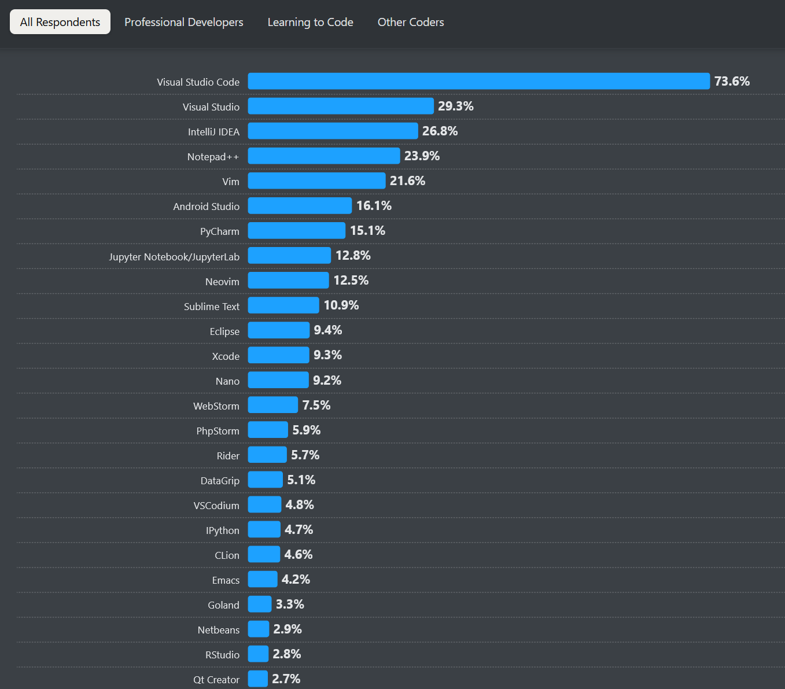

Ha ránézünk a [StackOverflow felmérésre](https://survey.stackoverflow.co/2024/technology#most-popular-technologies-new-collab-tools), akkor látjuk, hogy a Visual Studio Code az torony magasan ver mindenkit is. Én is jó IDE-nek tartom ezt, bár mivel van saját fizetett license-m az IntelliJ IDEA-ra, így első sorban azt használom. Ha valaki még is az IntelliJ mellet dönt, ahhoz van Community kiadás is. Eleinte, mindegy is melyiket kezditek használni, mert nem fogunk belemenni olyan témákba, ahol fizetős vagy speciális plugin-t kellene.

Természetesen azt is megtehetitek, hogy mind kettőt feltelepítitek és kipróbáljátok. Egyik projektet ebben, a másikat abban. Előfordulhat az is a jövőben, hogy a cég, ahol majd dolgoztok előre meghatározzák, hogy mely IDE-ben történik a fejlesztés, mert speciális kód-beállításuk van hozzá. **Jellemzően a Java-sok IntelliJ-t használnak,** de mindez megugorható VS Code-al is.

- Visual Studio Code: [https://code.visualstudio.com/download](https://code.visualstudio.com/download)
- JetBrains IntelliJ IDEA Community: [https://www.jetbrains.com/idea/download/](https://www.jetbrains.com/idea/download/) (lejjebb kell tekerni)

> [!WARNING]
> Nem minden JetBrains termékéhez van Community! De minden IDE-nek az IntelliJ az alapja. Tehát, ha hozzá csapsz a nyelvi plugin-t akkor többnyire ugyanott tartasz. (Persze a Rust plugin fizetős, de az IDE nem... WTF!?)

Legyen az alapvetés az, hogy `VS Core`-t használunk. Bármely nyelvet választanád, kövesd az adott nyelv beállításait [itt](https://code.visualstudio.com/docs/languages/overview), de nyelvenként azért mutatok ezt-azt. Mindennek elött ugorjuk meg azt a tényt, hogy kell egy IDE.

### VS Code telepítése
Ennek nem kellene nagy varázsnak lennie. Letöltöd [innen](https://code.visualstudio.com/download) és telepítés. Ha nem Windows-t használsz, akkor annak megfelelőt. `Red Hat` alapú rendszerre a `rpm` verziót, míg `Debian` alapú rendszerre a `deb` verziót, de ezeket írja is...

Telepítés meg a szokásos: next-next-next-finish

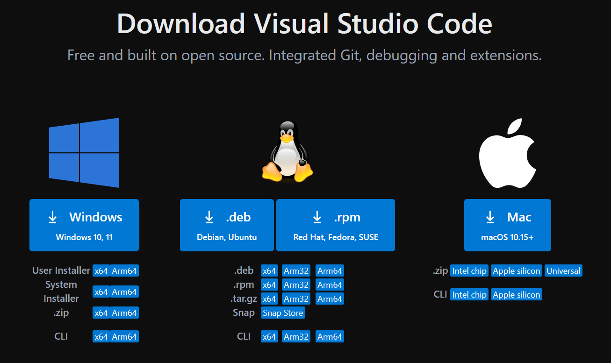

### Első indítás
Egy ilyet fogsz látni:

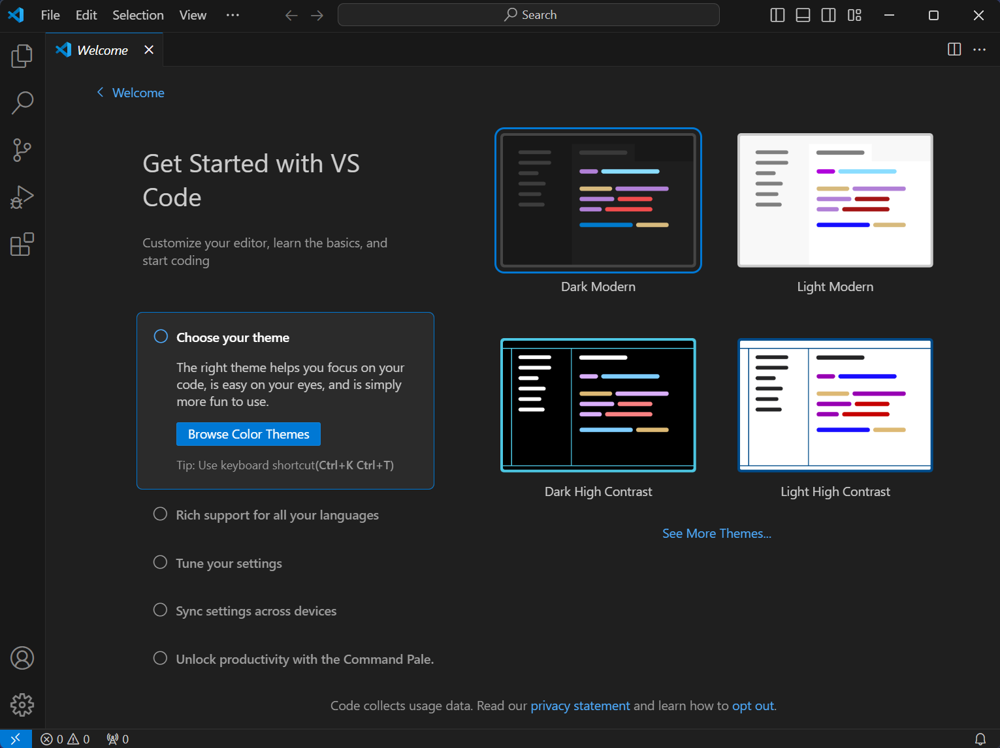

Itt javaslom, hogy a "Dark Modern"-t válaszd, hogy ne égesse ki a szemed a sok fehér. Ha fehér alapot jobban szereted, választhatod azt is.

A következő pont, ami érdekes lehet, az a `auto save`. JetBrains termékekben ez alapértelmezett beállítás, hogy ha írunk a fájlba azt lementi, így nincs szükség folyton menteni azt. Ez hasznos, ha egyszerre több fájlt szerkesztesz, és mindre szükség van. Előtud fordulni, hogy az egyiket nem mented el és azon bosszankodsz, miért nem jó...

Ha `Open Settings`-re mész, itt választhatod a `onFocusChange`-t mikor kikattintasz az adott fájlból.

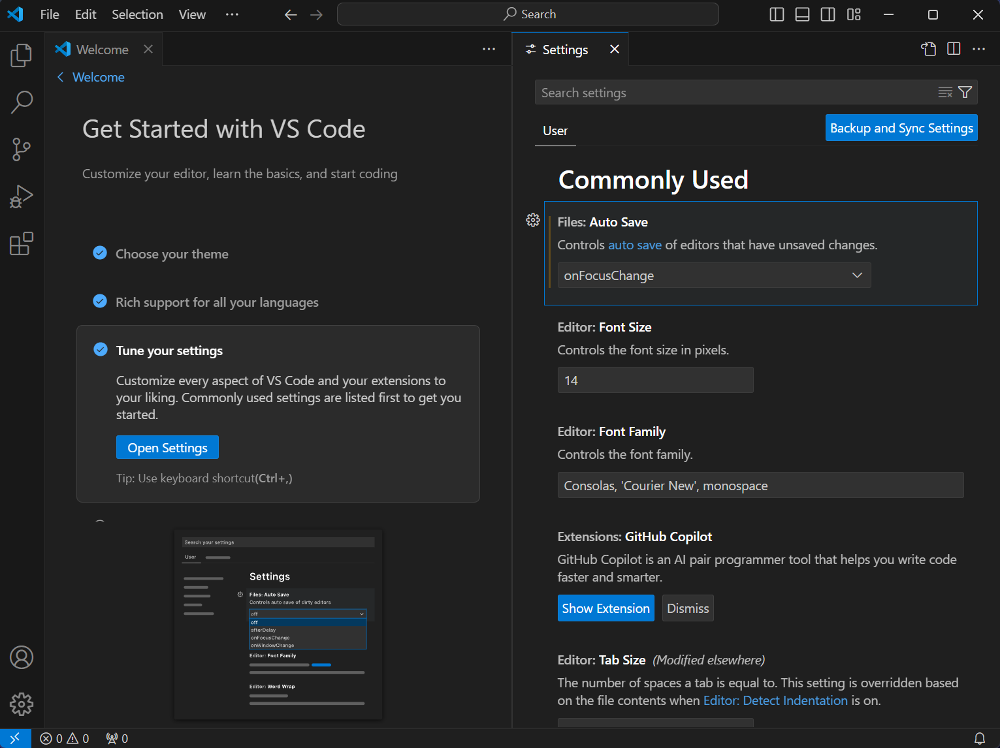

A többi nem fontos, nyomhatsz `Mark Done`-ra. (Igen tudom, hogy van Next Section, de ott sincs számunkra fontos dolog.) Bezárhatod a `Welcome` tab-ot.

### Platform előkészítése
Nem tudom melyik platformon vagy. Én a Windows és Linux környezeteken fogom bemutatni a dolgokat első sorban. Ha macOS-t használsz az hasonló a folyamat lesz, mint a Linux-on, csak ott a `brew` lesz az csomag telepítő parancs pl. az `apt` helyett, amiket [ezen az oldalon](https://formulae.brew.sh/) fogsz megtalálni. Megpróbálom a macOS-es utasításokat is bemutatni, de sajnos azokat nem tudom tesztelni macOS eszköz hiányában.

Linux-on vagy macOS-en nincs szükség választási lehetőségre és ezen oldal további információit ki is hagyhatod.

Windows-on azért már nem olyan egyszerű a történet. Az utóbbi időben a Windows is elkezdett a fejlesztők alá dolgozni, hogy egyszerűbb legyen, de így is akad 1-2 dolog, ami nem megugorható direktben vagy vadászni kell a programokat.

Így két lehetséges (ha úgy tetszik) támogatást mutatok be, ami segít a programok telepítésében vagy használatában. Az egyik ilyen a Chocolatey, ami inkább hasonlít egy Linux repository-hoz vagy akár említhetném a GooglePlay-t vagy AppleStore-t. De a Chocolatey egy program gyűjtemény tároló, ami leegyszerűsíti a programok telepítését és menedzselését, beleértve annak frissítését is. Ez közvetlen a Windows-ra telepít és onnan használható.

A másik lehetséges irány, amit bemutatok, a WSL2 (Windows Subsystem for Linux), ami egy virtuális Linux réteget hoz létre a Windows rendszerre. Így, az ide telepített programok Linux környezeten fog fugni, azaz az itt fordított program Linux környezeten fog végbe menni. Fontos, hogy a platform függő nyelvek Linux-os fordítást követően nem indulnak Windows-on és fordítva se. Azaz a Linux nem ismeri az `exe`-t.

[//]: # (TODO: Megvizsgálni majd, hogy WSL2 Hostolás esetében problémába ütközünk-e)
> [!WARNING]
> Nem tudom, hogyan fog viselkedni, ha WSL2-ben hosztolunk egy adott porton általunk írt projektet. Azt hogyan érjük el Windows oldalt böngészőből. Sose próbáltam. Majd, ha falba ütközünk, akkor majd korrigálom a leírást. Addigis első körben nem akadályoz mindent egy darabig.

### WSL2 plugin
Ha WSL2-en szeretnél fejleszteni és futtatni, akkor a szükséged lesz a WSL2 plugin-ra. Először is keres rá a WSL2 plugin-ra. Ezt egy "legó" szerű iconon keresztül tudod megtenni. (Segítséget [itt](https://code.visualstudio.com/docs/editor/extension-marketplace) találsz.) Majd tenyerelj rá az `Install`-ra.

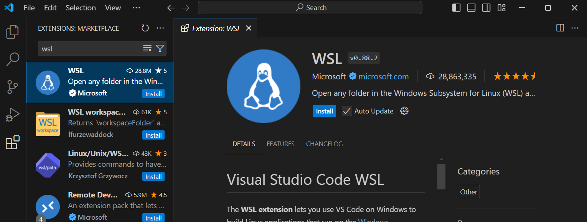

Ha van WSL2-ed már, akkor rátudsz csatlakozni.

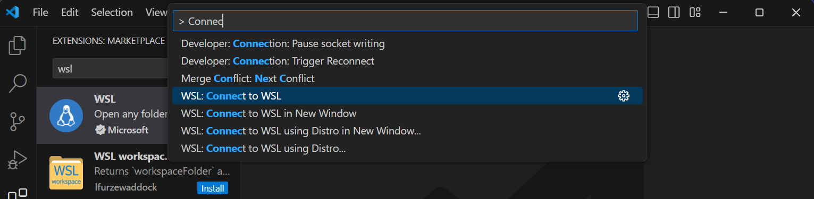

Majd bal-lent meg kell jelennie a `WSL2: Ubuntu-24.04`-nek, vagy amire csatlakoztál.

> [!IMPORTANT]
> Minden plugin telepítés elött csatlakoznod kell a WSL2-re, mert a plugin-t oda menti le és onnan használja. Ha későbbiekben nem használnád a WSL2-t, akkor a VS Code úgy látja, hogy nincs az a plugin feltelepítve!

## Windows Chocolatey telepítése

Telepítő leírás [itt](https://chocolatey.org/install).

Telepítéséhez nyiss egy adminisztrációs joggal egy Windows terminált. Ezt a Start-ra egér jobb gombbal klikk és válaszd a terminál rendszergazdával. Oda írd ezt be:
```powershell
Set-ExecutionPolicy Bypass -Scope Process -Force; [System.Net.ServicePointManager]::SecurityProtocol = [System.Net.ServicePointManager]::SecurityProtocol -bor 3072; iex ((New-Object System.Net.WebClient).DownloadString('https://community.chocolatey.org/install.ps1'))
```

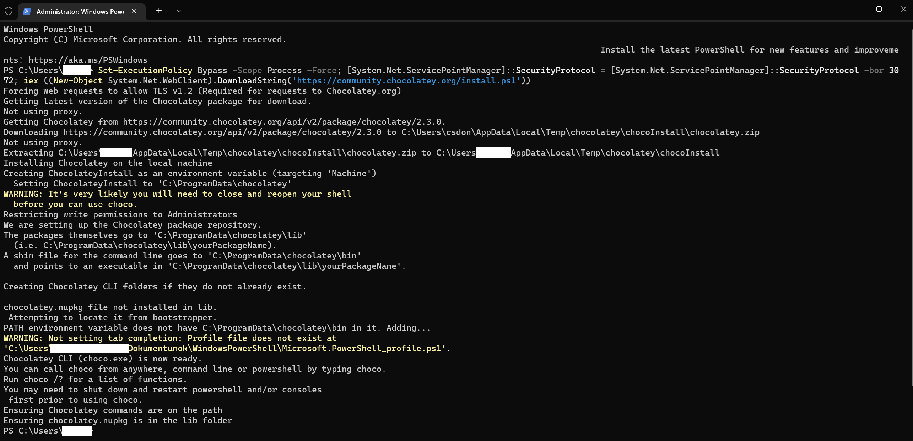

Kész is. Majd az első `choco install` esetén előfordul, hogy eltart majd egy darabig.


## Ubuntu WSL2 telepítés Windows-on

Teljes leírás [itt](https://canonical-ubuntu-wsl.readthedocs-hosted.com/en/latest/guides/install-ubuntu-wsl2/).

> [!NOTE]
> A folyamat során, ha jogosultsági ablakot dobna fel Igen/Nem kérdéssel, akkor minden esetben Igen-t kell nyomni.

1. Nyiss egy rendszergazda jogosultsággal egy terminált

    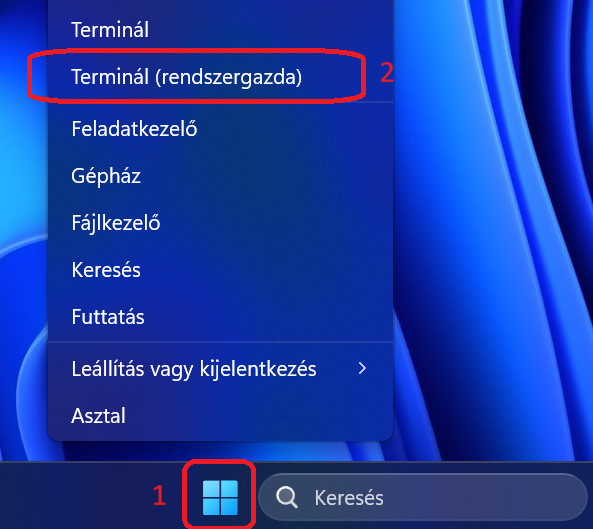

2. Add ki a következő parancsot:
    ```powershell
    wsl.exe --install
    ```
    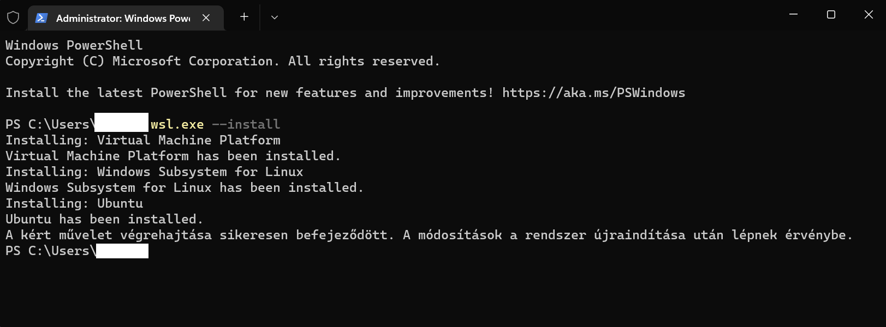

3. Ezt követően, ha Start menüben elindítod az Ubuntu-t, amit nem indulna el.

   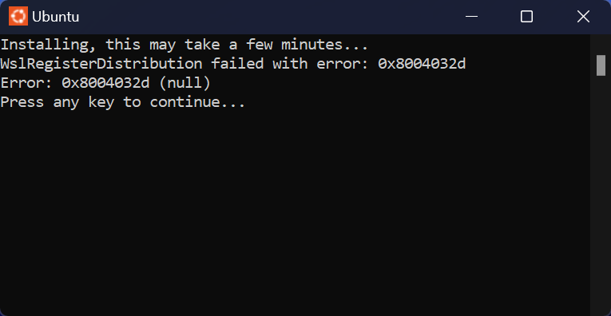

Itt két lehetőséged van a további telepítésre. Windows Store-ban megkeresed az Ubuntu 24.04-et (vagy amelyik tetszik) és azon keresztül telepíted, vagy a következő parancsokat adod ki az adminisztrátorral elindított Windows terminálon:

4. A következő azt eredményezi, hogy kilistázza telepíthető Linux-okat.
    ```powershell
    wsl --list –online
    ```
   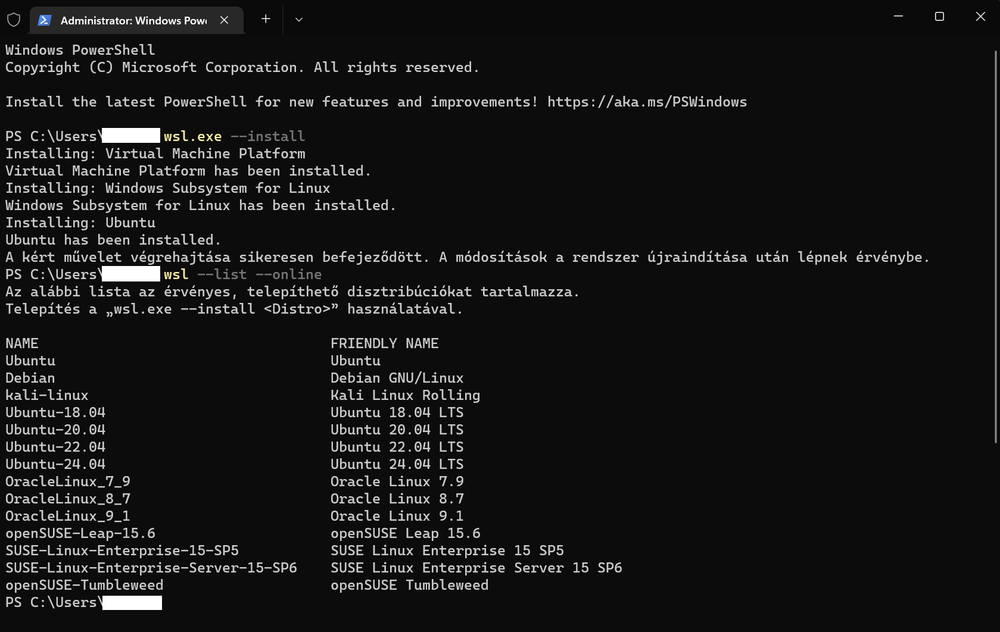

5. Én majd az Ubuntu 24.04-et fogom használni, így a lista bal oldali név azonosítót adom meg a következő parancsnak:
    ```powershell
    wsl --install -d Ubuntu-24.04
    ```
   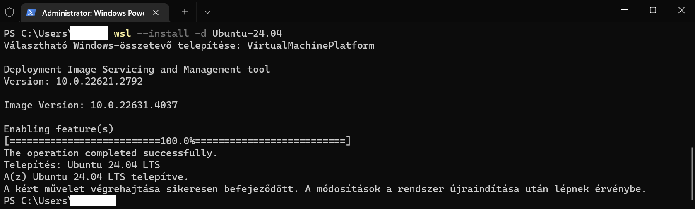

Ez a folyamat a jelenlegi `Ubuntu` (ami az előző hosszú kiadású rendszer) mellé teszi fel az újabb hosszú kiadású rendszert. A folyamat végén kövesd a lentebb lévő `Mit csinálj, ha több Ubuntu-d van` pontot.

6. Telepítés után kér minket a rendszer újra indítására. Ha ez kimarad, Ubuntu 24.04 is ugyanúgy megjelenik az alkalmazási listában, de nem fog elindulni.

    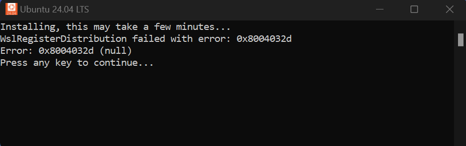

7. Újraindítást követően automatikusan elindul az Ubuntu konfiguráció (ha nem, csak indítsd el)

8. Kér egy felhasználó nevet, ez tetszőleges lehet.

   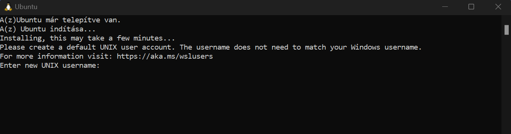


9. Majd kérni fog UNIX jelszót, kétszer. **Nem fogja jelezni, ha gépelsz! Nem fogsz látni `*****`-okat.** Ez lesz a felhasználód jelszó. **Mindenképpen jegyezd meg**, mert később kelleni fog.

    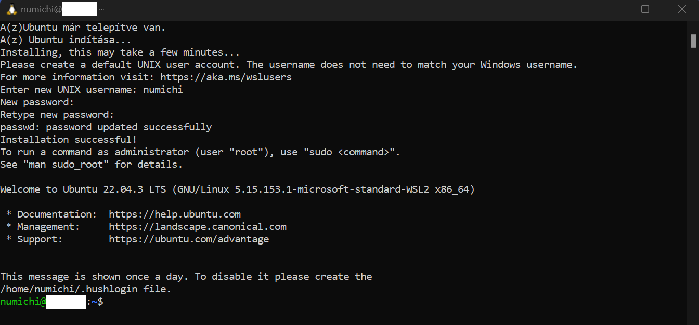

Meg is vagyunk. Kaptunk egy Linux WSL2-t. Most frissítsük.

> [!NOTE]
> Ha folyamat során `[Y/n]` kérdés elé állít, akkor az `y` az igen. A nagybetű annyit jelent, hogy ha nem írsz be `y` vagy `n`, hanem csak entert nyomsz, akkor a nagybetűs opció lesz érvényben.

Linux-ok rendelkeznek repository-val, ahonnan mindenféle jóságot lehet letölteni. Ezt inkább az Android GooglePay vagy AppleStore-hoz tudnám hasonlítani. De a Linux-ok nem panaszkodnak azért, ha új vagy több repository-t adunk hozzá. Tehát frissítsük az Ubuntu repository könyvtárát, hogy mik jelenleg az elérhetők.

10. Adjuk ki az update parancsot.
```bash
$ sudo apt update
```
A folyamat végén nagy eséllyel bejelez, hogy van mit frissíteni egy `120 packages can be upgraded. Run 'apt list --upgradable'` végső üzenettel. Ha ezt a parancsot kiadod `sudo`-val, mint a frissítést, akkor csak kijelzi, hogy miket húzna le és cserélne ki.

11. Tehát, hogy már tudja a linux-unk, hogy mikből van új verzió, akkor adjuk ki a következő parancsot:
```bash
$ sudo apt upgrade
```

> [!NOTE]
> A `sudo` annyit tesz, hogy "superuser do", azaz rendszergazda nevében adod ki a következő utasítást: `sudo <parancs(ok)>`. A `sudo` esetén alapértelmezett beállítás mellet mindig megkérdezi a felhasználói jelszavad, amennyiben van `sudo` jogod az adott parancshoz. _(Most lesz.)_ Ennek van egy lejárati ideje, azaz folyton `sudo`-t használva nem kéri be mindig a jelszót. Linux alatt, csak akkor `sudo`-z, ha máshogy nem megoldható az adott feladat. Pl. a telepítés és frissítés ilyen.

Van egy jó meleg ropogós és friss Ubuntu WSL2-ünk.

Mivel a WSL2 "szimbiózisban" él a Windows-al, így fájlok szintjén mindkét irányban elérhetővé válik a történet. Windows oldalt a Fájlkezelő-ből azonnal elérhető a linux mappa struktrája, de a linux-ból is a `C:/` és a többi meghajtó. Mivel nekem van 3 is, így a `/mnt/c` alatt lesz a `C:/`, ami zöld alapon kék betűvel jelez.

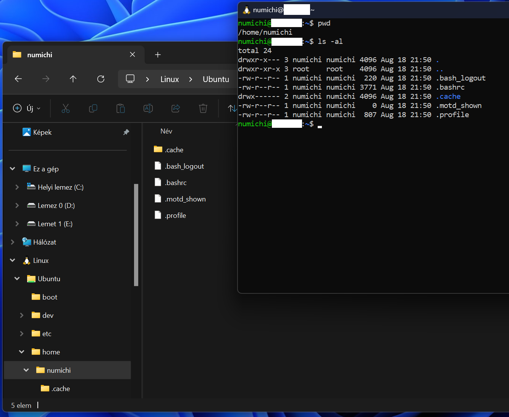

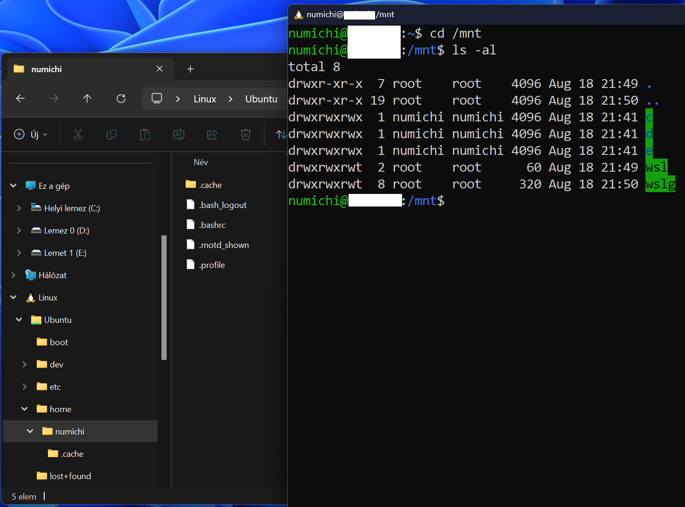

### Mit csinálj, ha:

#### Több Ubuntu-d van, de egyet szeretnél:
A fenti példában mikor én csináltam, egyszerre van jelen a 22.04 és a 24.04. Ubuntu-ból félévente jelenik meg új verzió, de 2 évente van hosszan támogatott kiadás (azaz LTS). A wsl telepítése a 22.04-et tette fel, de amit fent vázlatoltam, az a 24.04-et. Tehát, Windows-on a WSL2 alatt 2 rendszer mappának kellene lennie. Egy sima `Ubuntu` és egy `Ubuntu-24.04`-nek.

**Az egyik lehetőséged, hogy csak törlöd az alkalmazások közül:**

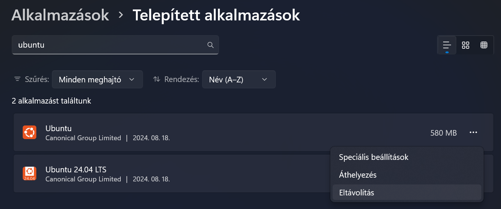

**A másik lehetőséged, hogy alapértelmezettet cserélsz és/vagy le regisztrálod a WSL2-ből**, de attól még megtartja és egy véletlen indítással újból aktív lesz (én úgy tapasztaltam):

Iníts egy adminisztátori windows terminált
Nézd meg milyen WSL2 rendszereid vannak:
```powershell
wsl -l
```
- Ha alapértelmezettet szeretnél váltani, akkor:
    ```powershell
    wsl --setdefault <rendszer név>
    ```
- Ha le szeretnéd regisztrálni:
    ```powershell
    wsl --unregister <rendszer név>
    ```

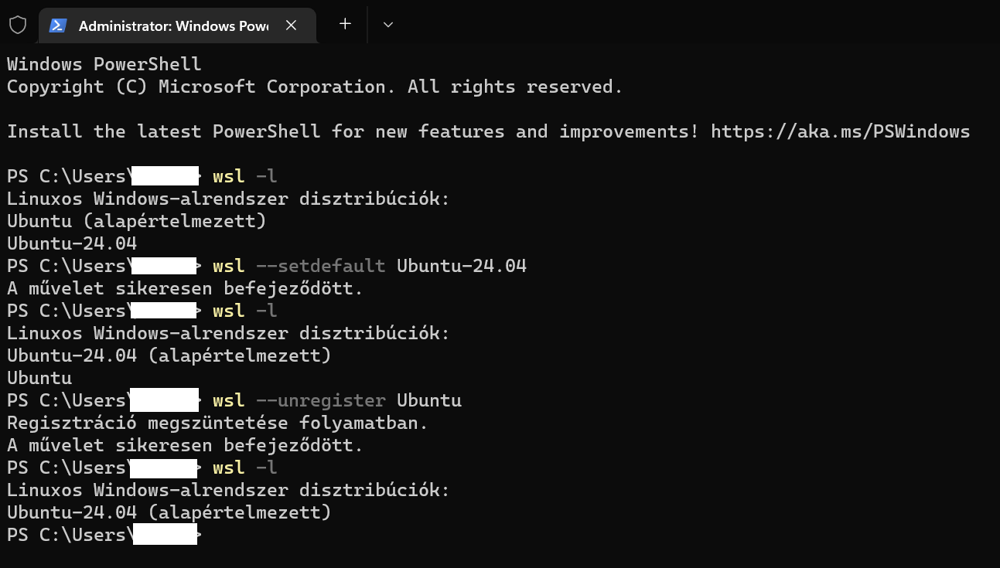

#### Véletlenül bezárod a felhasználó megadása nélkül?
Mivel nem adtál meg felhasználót, így a minden linux-on jelen lévő root-al fog indulni. Ezt abból látod, hogy `#` jelzi, nem pedig `$` szimbólum. Ekkor az alábbi a parancsot add ki. _Értelem szerűen a `<felhasználó név>` esetén a `<>` nincs szükség. Azaz az én esetemben `numichi` lesz, nem pedig `<numichi>`._
```bash
adduser <felhasználó név>
```
Meg kell adni a felhasználó nevet és annak jelszavát. A többi adatbekéréssel ne foglalkozz. Csak nyomogasd az entert.
Ez a felhasználó, csak mezei user. Mivel a frissítés és telepítéshez, sudo szükséges (amit root-ként is meg tudsz tenni amúgy, sudo nélkül), így adjunk hozzá a felhasználót a sudo csoportba a következővel:
```bash
usermod -aG sudo <felhasználó név>
```

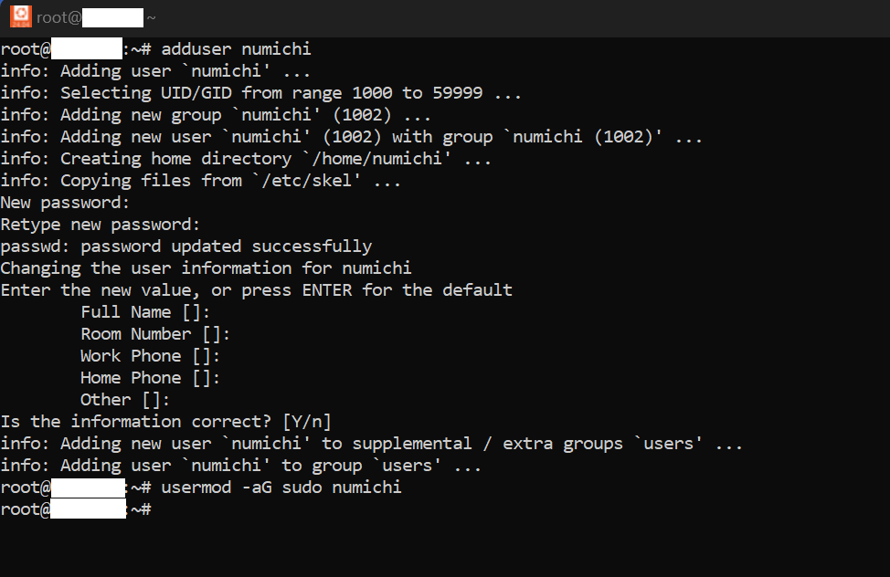

Ezen a ponton bezárhatod az ablakot vagy átjelentkezhetsz az újonnan létrehozott felhasználó fiókba. A su és a felhasználó név közé szóközzel elválasztott kötőjelre szükség van:
```bash
su - <felhasználó név>
```

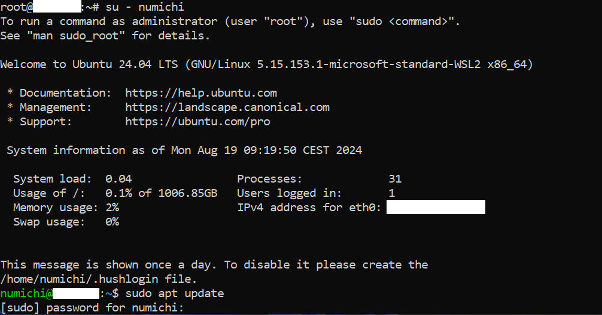

Majd folytathatod a frissítés (update, upgrade) a fenti pontok alapján.

#### Nem jelentkezik be a megadott felhasználódba?
Azt tapasztalod, hogy azonnal `root@<host>:~#`-el indul? Nézd meg, hogy létezik-e a `HOME` mappa a kívánt felhasználónak egy `ls /home` paranccsal. (Létezhet úgy felhasználó, hogy nincs mappája!)

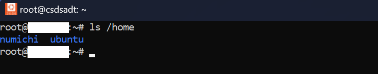

Ez akkor fordulhat elő, ha új felhasználót adtál meg és nem volt ezelött. Zárd be a Ubuntu terminált, majd indíts adminisztrátorral egy Windows terminált. Ha tudod melyik Ubuntu-t szeretnéd állítani, akkor annak megfelelő exe-ére lesz szükséged. Például: `ubuntu2404.exe`.
```powershell
ubuntu2404.exe config --default-user <felhasználó név>
```
Majd intsd az Ubuntu-dat.


