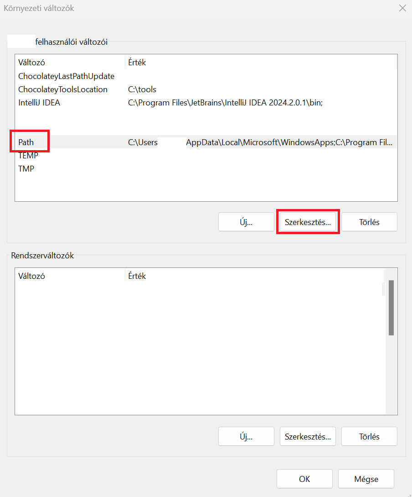

# Nyelvi környezet

## C, C++

### Telepítés
Forrás: [C/C++ for Visual Studio Code](https://code.visualstudio.com/docs/languages/cpp)

#### Linux, WSL2
Ha Linux-on vagy, vagy WSL2-t használsz, akkor egyszerűen kiadod ezt, vagy a disztribúciónak megfelelően.
```bash
$ sudo apt install gcc g++
```

#### macOS
```bash
$ brew install gcc
```

#### Windows Chocolatey
```powershell
choco install -y msys2
```

Ezt követően elhelyez el helyez egy `tools` mappát a `C:\` alatt. Ezen belül indísd el a `C:\tools\msys64\crt64.exe`-t, majd írd be ide, hogy:

```bash
$ pacman -S --needed base-devel mingw-w64-ucrt-x86_64-toolchain
```

Telepítés alatt két kérdést fog feltenni. Elegendő, ha mindkét esetben csak egy `enter`-t nyomsz. Majd, mihelyt visszaadta a prompt-ot _(azaz a parancs beíró mezőt ami `$` kezdődik)_, bezárhatod az ablakot.

Most állítsuk be a környezeti változót, hogy hozzá férj Windows oldalt a feltelepített fordítóhoz.

Ehhez Windows Start-ot megnyitva vagy az alkalmazás keresőbe írd be, hogy `környezeti` vagy csak az elejét. Meg kell jelennie egy `A rendszer környezeti változóinak módosítása` elemnek. Azt nyisd meg. Ilyet kellene, hogy kapj. Majd legalul válaszd a `Környezeti változók...`-ot.


Jelöld ki a fenti ablakban a `Path`-ot majd kattints a `Szerkesztés…` gombra.



Megjelenik egy szerkesztési ablak, ahol új mezőt kell felvenni. Kattints az `Új`-ra, majd megjelenik egy kurzor, ahova betudnál gépelni valamit. Ekkor vagy kézzel adod meg, vagy `Tallózás`-ra kattintva oda navigálsz. Amit keresned kell: ` C:\tools\msys64\ucrt64\bin`. Mihelyt sikerült hozzáadni, csak `OK`-ézd le az összes ablakot.


Nyiss egy windows terminált és írd be ezt, hogy `gcc --version`. Ha kiírja a következőt vagy hasonlót, jó voltál.

```
gcc.exe (Rev3, Built by MSYS2 project) 14.1.0
Copyright (C) 2024 Free Software Foundation, Inc.
This is free software; see the source for copying conditions.  There is NO
warranty; not even for MERCHANTABILITY or FITNESS FOR A PARTICULAR PURPOSE.
```

#### Windows kézi telepítés

A [MSYS2 oldalán](https://www.msys2.org/) kézzel töltöd le a telepítőt. Ezt az `Installation` vörös cím alatt találod közvetlenül. Neve: `msys2-x86_64-<DÁTUM>.exe` lesz. Ezt indísd el, majd next-next-next. Nem kell külön megnyitni, mert telepítés után megnyílik neked automatikusan. Ha még se, akkor megtalálod `C:\msys64\crt64.exe` itt.

Innentől megegyezik a `Chocolatey` verzióval, annyi eltéréssel, hogy nem kell a `tools` útvonal, mert alapértelmezetten a `C:\` alá teszi.

### VS Code beállítása

> [!NOTE]
> Ha van WSL2-t Windows-on és oda dolgozol, akkor csatlakozz plugin telepítés elött.

#### Plugin telepítés
3 Plugin-t szükséges telepíteni. A Plugin nézethez kattints bal oldalon a plugin menüre.

- C/C++
- C/C++ Extension Pack
- Code Runner (Ha már fent van, nem szükséges mégegyszer)


#### Teszt futtatás
Hogy meg bizonyosodjunk, hogy készen áll-e a környezet, akkor csináljunk két ideiglenes fájlt, amit majd törlünk a folyamat végén.

Egy üres fájl létrehozása:

- Jobb fent `File` -> `New file...` -> `Text file` (kattints rá)
- Felülre a `search` mezőbe beírod, hogy `> text file`. A `>` karakter szükséges, amit az jobb oldali `Alt` vagy egyes billentyűzeteken `AltGr` és `í` karakter.
- Egyszerűen lenyomod a `Ctrl + N` kombinációt.

Az egyik tartalma legyen ez a `C` kód, és mentsd el `Ctrl + S` kombinációval `example1.c` néven. A `.c` a fontos.
```c
#include <stdio.h>

int main() {
    printf("Hello, World!\n");
    return 0;
}
```

Az másik tartalma legyen ez a `C++` kód, és mentsd el `Ctrl + S` kombinációval `example2.cpp` néven. A `.cpp` a fontos.
```cpp
#include <iostream>

int main() {
    std::cout << "Hello, world!" << std::endl;
    return 0;
}
```

Válaszd ki azt a fájlt amit futtatni szeretnél és jobb fent látsz egy "lejátszás" gombot és mellette egy lefele mutató nyil szerüséget. (Ha ráviszed az egeret kiírja, hogy `Run or Debug...`). Azt lenyítva a `Run Code`-ra menj. Vagy a gyorsabb megoldás a mellette jelzett "short-cut", azaz a `Ctrl + Alt + N` ugyanazt eredményezi.

Meg kellene jelennie egy `OUTPUT` nevű új belső ablaknak, ahol látnod kell a következőt:

```
Hello, World!
```

Ha ez meg van, akkor SIKER! Akkor kitörölheted a fájlokat. Vedd figyelembe, hogy most 4 lesz. 1-1 `.c` és `.cpp` mellet további kettő. Ezek a lefordítottak. Windows esetén ezek `.exe`-k lesznek. Ezek mehetnek a levesbe.

## Rust

Írás alatt

## Go

Írás alatt

## Java

Írás alatt

## Kotlin

Írás alatt

## Python

Írás alatt

## PHP

Írás alatt

## JavaScript, TypeScript

Írás alatt

## HTML, CSS

Nincs szükség, a böngésző értelmezi közvetlen a fájlokból.
