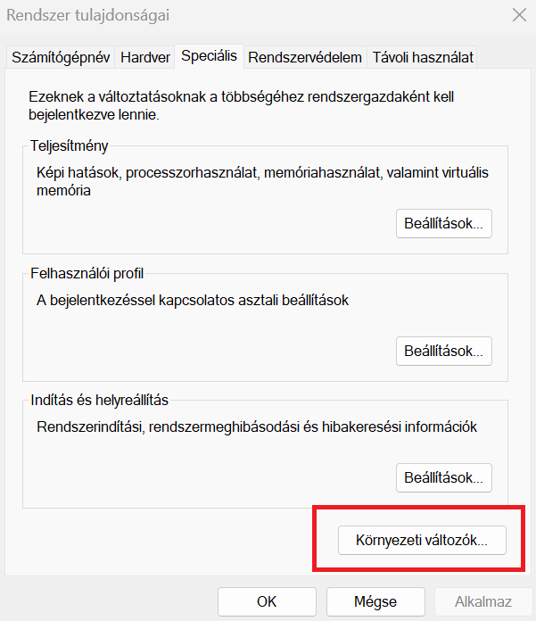

# Nyelvi környezet:

## C, C++

Linux-osok előnyben vannak, mert a GCC vagy a G++ telepítése ott csak egy parancs disztribúciótól függően. Debian/Ubuntu-n `sudo apt install gcc` és jónapot.

Windows-on azért körülményesebb, de több módon is megoldható. Az egyik megoldás a WSL2 és csinálunk egy Linux réteget a Windows-ra, csak ez se olyan magától értetődő. A másik megoldás, hogy telepítünk egy MSYS2-t a Windows-ra és alkalmaznunk kell egy egyedi beállítást a rendszeren. Nyilván, ha uninstall-állod a MSYS2-t, akkor ezt a beállítást ugyanúgy kézzel kell eltávolítani. Garantált, hogy elfogod felejteni. :) Az utóbbit itt mutatom be, míg a WSL2-t egy másik bekezdésben, mert az univerzálisabb dolog.

Én személy szerint az WSL2-t jobban szeretem, mert szimbiózisban működik a Windows-al és nem szemetelem a Windows-t, de azt használod amelyiket szeretnéd. Ha WSL2-t nem tudod működésre bírni, akkor maradj a MSYS2-nél. Akkora baj nincs.

### VS Code beállítása

> [!WARNING] Figyelem!
> Ha nincs MSYS2-d vagy WSL2-ed, akkor az egyiket lépd meg a VS Code beállítása elött, mert a VS Code-nak kelleni fog a fordító.

### MSYS2 telepítés

A VS Code dokumentáció lényegében végig vezet a telepítésen, de pontokba szedem neked a hogyanokat.

1. Látogass el [ide](https://code.visualstudio.com/docs/languages/cpp).

2. Legörgetsz addig, ahol látod a `Example: Install MinGW-x64 on Windows`-t, vagy jobb oldalt a navigáción kiválasztod.

3. Rákattintasz a `MSYS2` kék linkre, ez megnyit egy új oldalt

   

4. Pirosan ott virít, hogy **Installation**, és első pontjában látsz egy `msys2-x86_64-<dátum>.exe-t`. Kattints rá és tölsd le.

5. Viszamegyünk a VS Code dokumentációjára, ahonnan elnavigáltunk.

6. Indítsd el a telepítőt, amit letöltöttél. Kövesd a tipikus Windows telepítő stratégiát: next-next-next-finish

7. A végén megjelenik egy fekete terminál. Ide írd be a következő parancsot. Ha oldalon mást ír, akkor azt. (Lehet, hogy az, amit kimásoltam már elavult.)
    ```bash
    $ pacman -S --needed base-devel mingw-w64-ucrt-x86_64-toolchain
    ```
   

8. Amikor választás elé állít, csak nyomj entert
9. Miután befejezte, csak zárd be az ablakot. Ha még is visszahoznád akkor Start-nál beírod a `MSYS2 UCRT64`-t és megnyitottad ismét a terminálját.


**Beállítjuk a Windows környezetet:**
- Nyisd meg a környezeti változó beállító felületet. Erre a Start menüből könnyedén rá tudsz keresni.

  

- Válaszd ki a Path-ot és szerkesztés

  

- Adj úgy sort ezzel: `C:\msys64\ucrt64\bin` (vagy tallózz és keresd meg a bin mappát és arra nyomj OKÉ-t, ahova telepítetted)

  

- `OK`-ézzünk le mindent

Nyiss egy windows terminált és írd be ezt, hogy `gcc --version`. Ha kiírja a következőt vagy hasonlót, jó voltál.
```
gcc.exe (Rev3, Built by MSYS2 project) 14.1.0
Copyright (C) 2024 Free Software Foundation, Inc.
This is free software; see the source for copying conditions.  There is NO
warranty; not even for MERCHANTABILITY or FITNESS FOR A PARTICULAR PURPOSE.
```


## Java

#### Telepítés Chocolatey-val Windows-ra
Telepítő parancsot [itt](https://community.chocolatey.org/packages/openjdk/21.0.0) találod, ami:

```powershell
choco install openjdk --version=21.0.0
```

#### Telepítés Debian/Ubuntu vagy Ubuntu WSL2-en
```bash
$ sudo apt serach openjdk
```
```
openjdk-21-jdk/noble-updates,noble-security 21.0.4+7-1ubuntu2~24.04 amd64
  OpenJDK Development Kit (JDK)
```
```bash
$ sudo apt install openjdk-21-jdk
```
