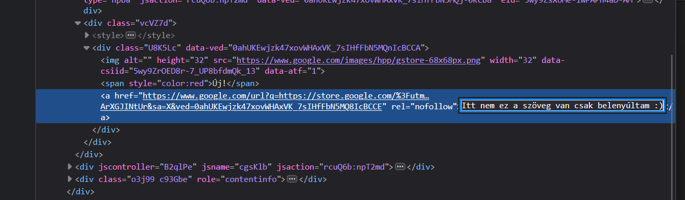

# Válasszunk nyelvet
Egy nyelv választás fontos tényező is lehet, ha hangokra hallgat és nem szakember mondja meg az irányt. Az utóbbi is tévesnek ítélem meg, mert ne egy random ember mondja meg, hogy mit szeretne a tanuló. Legrosszabb esetben a kedvét is elveszi. Ezért, én bemutatom a környezetet, hogy mik a jelenleg használtak vagy aktívan tanult nyelvek. Milyen maga a közösség? Melyik nyelv mire jó?

Amúgy megsúgom, hogy a legtöbb nyelv [Turing](https://hu.wikipedia.org/wiki/Turing-g%C3%A9p)-teljes. Azaz, minden megvalósítható benne, mint a másikban. Tehát, nem is maga a nyelv lesz a kérdés, hanem a nyelv köré épített és hozzáadott bővítések (könyvtárak) és maga a nyelv viselkedési jellemzője.

Máshogy működik és máshogyan kell használni egy Java nyelvet, mint egy Go-t, még ha ugyanazt is szeretnéd megvalósítani. Tehát, úgy tudnám összehasonlítani, mint A-ból B-be mennél, de egyszer autót használsz utazáshoz, máskor meg egy motort. A KRESZ szabályok 99%-ban ugyanaz, csak a használt eszköz más.

Igen, hogy meglepő legyen az [Excel is Turing-teljes](https://prog.hu/hirek/5648/turing-teljes-lett-az-excel-o-lehet-az-uj-legnepszerubb-programozasi-nyelv) lett... :raised_eyebrow: Tehát, papíron weboldal-t is lehetne benne írni. Az már, másik kérdés, hogy mennyire alkalmas rá. :)

## Nyelv választás
Nézzük a [StackOverflow - 2024 Developer Survey](https://survey.stackoverflow.co/2024)-t, hogy mik a használt nyelvek és a népszerűek tanulás szempontból. Szeretném kiemelni, hogy nem a TOP-lista szerint fogok választani nyelveket!

Ha megnézzük a nyelveket, [amikben szakemberek fejlesztenek](https://survey.stackoverflow.co/2024/technology#most-popular-technologies-language-prof) látjuk, hogy eléggé eltér a [tanuló nyelvektől](https://survey.stackoverflow.co/2024/technology#most-popular-technologies-language-learn).

### Fejlesztők által használt

Így ránézve megtévesztő egy összehasonlítási alap. Miért? A fejlesztők ~64%-a használja a `JS` JavaScript-et. Ennek azaz oka, hogy a legtöbb felület beleértve ez az oldal is `JS`-eket futtat. Böngészők eredetileg nem is nagyon tudnak mást. _(Most a WebAssembly-re nem térek ki.)_ Így aki úgynevezett `FrontEnd` fejlesztő szeretne lenni (amit a felhasználó lát), számára a `JS` ismerete majd-hogy-nem elengedhetetlen. Így ebből a kötelezőségből, a `JS` nyelvre felhajtó erőként hat.

[//]: # (TODO: NoSQL-ről írni)
Az [SQL](https://hu.wikipedia.org/wiki/SQL) is hasonló cipőben jár csak `BackEnd` azaz szerver oldalon. Azért van rá szükség, mert ezzel a nyelvezettel lehet kommunikálni a relációs adatbázisokkal. ([Több termék is van.](https://db-engines.com/en/ranking/relational+dbms)) Angolul **D**ata**b**ase, röviden csak `DB`. Az adatbázisok arra használatosak, hogy hosszú távon tároljunk adatokat strukturált formában, hasonlóan a HDD vagy SSD-hez a saját fájljaidat vagy bármit amit lementenél. Ahogy a számítógépet kikapcsolod a nem lementett adatok elvesznek. Ez igaz a programokra is mikor leállnak, de ezt tapasztaltad már gondolom.

Szorosan követi a `HTML/CSS`. Hát ez egy kakukk tojás... :sweat_smile: A `HTML` és a `CSS` egy [leíró dokumentum](https://hu.wikipedia.org/wiki/HTML), nem pedig programozási nyelv. `HTML` a felület strukturáját adja, míg a `CSS` annak stílusát. Ha megnyitsz egy tetszőleges oldalt egy böngészőben `F12`-vel előtudod hozni a "vizsgálat"-ot, ahol megtudod nézni hogy épül fel az oldal. Ha bele nyúlkálsz az oldal is változik annak megfelelően. Ezzel lehet azt a látszatot kelteni, hogy pl. egy hír rólad szól vagy átírod a tartalmat, képet készítesz róla és ijesztgetsz másokat... De a valós tartalom ezzel nem változik. Egy oldal frissítéssel vissza áll az eredeti formájára.

A `PY`, ami a `Python` és a többi nyelv, már közelebb áll a valósághoz, mármint a program nyelvekhez és persze az első helyezett a `JS` is az.

### Nyelvek amit tanulnak

Látszik, hogy most mindenki a `Python`-ra izgul. Ez nem véletlen és több oka van. Egyrészt a `Python` egy univerzális nyelv (köhöm.. a többi is az), amit viszonylag könnyű elsajátítani és sokan is ajánlgatják. Továbbá [BigData](https://lexunit.hu/blog/mi-az-a-big-data-es-mire-hasznaljuk/) szakirányban vagy `AI` azaz mesterséges intelligencia körökben is sűrűn használt a kiforrott eszközei miatt, mint más nyelv.

Ennek ellenére, miért nem ajánlom mégse kezdő nyelvnek? Mert nem fekteti le az alapokat, hanem azokat átvállalja, elrejti, leegyszerűsíti és így csábít át a "sötét oldalra", hogy azokat ne is tanuld meg. (Most jó sok ellenséget szereztem magamnak... :D) Persze a `Python`-t is előveszem, mikor majd algoritmusokat nézünk. Fogjuk használni. :wink:

A `HTML/CSS` és a `JS`-ről már meséltem. Azonos az aránya is ~60.4%, mert össze függ. FrontEnd, felhasználói felület ugye.

### Egyéb statisztikák, források
Tapasztalt szakemberek is folyamatosan kutatják, hogy melyik technológia, hogy fejlődik és melyik milyen problémára alkalmas. Itt fontos megemlítenem és egyben legyen alap tétel is, hogy problémára választunk eszközt/nyelvet, nem pedig egy nyelvel akarjunk mindent megoldani. Az utóbbi nem lesz optimális, azaz túlsok időt, energiát és pénzt éget el. Tehát, azaz ember "sikeres", aki kevesebb energia befektetéssel jobb eredményt tud előállítani. A kóklerek ki fognak hullani.

> [!WARNING] Alap megközelítés
> Problémára választunk eszközt! Vagy magadat szivatód vele.

Ha gondolod meghazudtolhatsz. Én megengedem, hogy hugyozz széllel szemben.

#### StackOverflow Trends Chart

A StackOverflow egy szakmai gyakorikérdések lényegében. Minden féle nyelvvel, technológiával kapcsolatban van kérdés fejlesztői és üzemeltetői oldalon. Amit most hoztam nektek az egy aktivitási, kérdés feltevési ábra, hogy hónapról hónapra egyes nyelvekkel kapcsolatban hogyan alakult a kérdés szám a StackOverflow-n az összes kérdéshez arányosítva.
Ebből is kikövetkeztethető, hogy világ szinten melyik nyelv van inkább használva vagy kísérletezés alatt.
Itt leolvasható, hogy:
-	2023 eleje fele van egy beszakadás a top nyelvekkel kapcsolatban. Vagy a kirúgási hullám miatt nincs annyi aktív munkavállaló, akinek lenne oka keresgélni? Vagy a [GitHub Copilot](https://github.com/features/copilot) kiváltotta a StackOverflow keresések egy részét?
-	Python 2012 óta emelkedik, olyan 2023 fele beszakad. Az előző pont lehet az oka vagy egyszerűen bedőltek az AI StartUp cégek?
-	C# és a Java azért arányosan mozog.
-	C nyelv az nem inog meg. Bármi történjék is. Stabilan mennek a kérdések.

A StackOverflow vannak egyéb aloldalai, amik operációs rendszerrel foglalkozik például.

Ha régi lenne a kép, [itt](https://trends.stackoverflow.co/?tags=java,c,python,c%23,javascript,assembly,php,go,c%2B%2B,rust) a keresett link.

#### Google Trends
A [Google Trends](https://trends.google.com/trends/explore) is hasonló, csak itt a Google keresésekből lehet statisztikát lekérni. Sajnos nem enged annyi keresési tételt, mint a StackOverflow, de ez is egy jó kiinduló alap. Nyugodtan másszatok fel rá, és nézelődjetek.

Hoztam innen is 2 képet. Az egyik Magyarországon rákeresett nyelvek, míg a másik a világszerte. Plusz, ha beállítok egy kategóriát a magyar vonalra, máris a Java nyelv kerül első helyre.

#### Salary Guide-ok
A `Salary Guide`, magyar "bér iránytű" is amolyan piaci elemzés és fizetések össze-matekozása. Nem csak a – szerintük - elérhető fizetéseket osztják meg, hanem a piaci helyzetet. Itt most hozok 3 oldalt
-	[BlueBird](https://bluebird.hu/) egy fejvadász cég, de ők is évente közzé teszik a saját tapasztalataikat évente, olyan év vége felé.
-	[Hays](https://www.hays.hu/) is ilyen téren mozog ugyanilyen intervallummal, de inkább tavasz magasságában publikálják a sajátjukat
-	Amit [itt](https://techfizu.robi.dev/) találtok, ez pedig a Hays-nek amolyan fizetési összesítője évekre bontva, hogy lehessen követni a változásokat.

Mivel a jelen pillanatban a Hays a legfrisebb (amiről tudok) így annak a piaci elemzését vágom most ide be.
Előre is elnézést kérek, hogy így ide copy-zom.

**Forrás:** Hays Salary Guide 2024 [letölhető PDF](https://www.hays.hu/documents/63283/61549493/HU+SG24+Digital+01+2024+secured.pdf)

> A covidot követő toborzáscunami után 2023 óriási hullámvölgyet hozott a teljes munkaidős munkavállalók felvételében az IT területén. A kulcsszavak a stabilitás, kivárás és megtartás voltak, és egyelőre nem látni, hogy ez 2024-ben drasztikusan változna. A toborzás lassulása mellett alábbhagyott a bérek évek óta tartó dinamikus emelkedése is. Sok esetben nem nőttek a bérek, de volt szakterület, ahol némileg csökkentek is. Mindez főként a munkaerőigény csökkenésének tudható be, és hogy a leépítések nyomán felszabadult jelöltek nem találtak állást, illetve akik váltani akartak, kevés lehetőség közül válogathattak. Az évek óta jelöltvezérelt piac hirtelen pozícióvezéreltté alakult.
>
> <h3>IPARÁGI TRENDEK</h3>
>
> <h4>A csapból is az AI folyt</h4>
>
> Kétségtelen, hogy a mesterséges intelligencia témája meghatározta a 2023-as évet. Az egyre magasabb szintű technológiát tömegesen kezdték el használni a vállalatok, a szakemberek és a lakosság is. Habár a mesterséges intelligencia a mindennapokban eddig is velünk volt, illetve számos ilyen jellegű fejlesztés zajlott folyamatosan, mégis idén történt meg a nagy áttörés. Ma már a legtöbb szakmai fórumon legalább említés szintjén biztosan szóba kerül az AI, és ez várhatóan 2024-ben is így lesz.
>
> <h4>Fókuszban a felhő és a DevOps-mérnökök</h4>
>
> A vállalatok életében továbbra is meghatározó a cloud technológia és annak elterjedése. Ez a trend évek óta velünk van és velünk is marad, mert előbb-utóbb minden vállalat felhőalapú technológiákat fog használni. Azonban mivel ez a szakterület még mindig nagyon új, a jelöltek száma továbbra is limitált. Változatlanul nagyon keresettek a valamely cloud technológiában tapasztalt DevOps-mérnökök, akik átlagosan 70%-ban fejlesztéssel és 30%-ban üzemeltetéssel foglalkoznak.
>
> <h4>A szoftverfejlesztőknél a fullstack az aduász</h4>
>
> A vállalatok nagyon sok mindent megadnak ma az igazán jó fullstackes szakemberekért, akik minden bizonnyal a közeljövőben is nélkülözhetetlenek lesznek. A széles körű programozói kompetenciák mindig is versenyképesek voltak, de ezen a szakterületenmég a többihez képest is kiemelten fontos a rutin. Az igazán értékes fullstackes – egyszerre backend és frontend oldali szoftverfejlesztői – tudáshoz legalább 5 éves szakmai tapasztalat szükséges a jelölt oldaláról.
>
> <h3>POZÍCIÓK</h3>
>
> 2023-ban, és az iparági trendeket figyelembe véve várhatóan 2024-ben is **a legkeresettebb pozíciók** a Fullstack Developer és DevOps Engineer lesznek a szektorban.
> - **A legjobban fizető** pozíciók a szoftverfejlesztői szakterületen vannak, azon belül is a frontend, a Python és a Java technológiákkal dolgozó szakemberek keresnek a legjobban.
> - **A leginkább elérhető** szakemberek jelenleg a tesztelési, infrastruktúra és projektmenedzsment szakterületen vannak.
> - **A legkevésbé elérhetők** a tapasztalt DevOps-mérnökök, Salesforce-szakemberek, datával foglalkozó szakemberek, Python-fejlesztők és Node.js-fejlesztők.
>
> <h3>TOP 3 TREND 2024-BEN</h3>
>
> 1. Minden bizonnyal több IT-fejlesztési projekt lesz 2024-ben, mint az előző évben, de mérsékelt lesz a növekedés. Ha 2022 az IT-toborzás éve volt, akkor 2023 annak az ellentéte. Valahol a kettő között lesz a megoldás, de közelebb a 2023-as évhez.
> 2. A bérek várakozásaink szerint infláció alatti mértékben fognak növekedni 2024-ben is, annak ellenére, hogy a jelöltek nagy vágya, hogy inflációkövető fizetésemelést kapjanak évről évre.
> 3. A vállalati oldalon a megtartás várhatóan továbbra is prioritás lesz. A kulcspozícióban lévő és igazán jó jelölteknek jobb tárgyalási alapjuk lesz, és ezáltal az ellenajánlatok nem csak velünk maradnak, még többre számítunk

#### Technology Radar
Ez a rész, kevésbé tartozik ide ezért is tettem így a végére, de fontos, ha technológiát vagy eszközt kellene választani és ahelyett, hogy magad kísérletezd ki, ezt megteszik mások is. [Ezen](https://www.thoughtworks.com/radar) az oldalon lehet követni mik léteznek és miket érdemes használni vagy szintúgy kipróbálni, hát ha beválik vagy megtetszik. De előre szólok. Itt MINDEN is van.

Rövid leírás róluk:
> A Thoughtworks Technology Radar egy félévente frissülő ismeretmegosztó eszköz, amely a technológiai környezetet mutatja be. Az alábbiakat tartalmazza:
>
> - Technikák: Az aktuális projektek során felfedezhető technikákat.
> - Platformok: Különböző platformokat és keretrendszereket.
> - Eszközök: Hasznos eszközöket.
> - Nyelvek és keretrendszerek: Programozási nyelveket és keretrendszereket.
>
> Minden elemet egy "blip" képvisel, és négy kategóriába sorolják őket:
>
> 1. Adoptálás: Olyan blippek, amelyeket érdemes komolyan fontolóra venni.
> 2. Tesztelés: Olyan dolgok, amelyek használhatók, de még nem teljesen bizonyítottak.
> 3. Értékelés: Olyan elemek, amelyeket érdemes megvizsgálni, de még nem feltétlenül tesztelni.
> 4. Óvatosság: Vigyázat, ezekkel óvatosan kell bánni.
>
> A Radar segít a projektek során felfedezni az új lehetőségeket és a bevált módszertanokat.

## Nyelvek

Hát, akkor válasszunk nyelvet. Nem lesz egyszerű. Ha nem olvastátok el a Hays POZÍCIÓK részét, akkor most ide bevágom.

> 2023-ban, és az iparági trendeket figyelembe véve várhatóan 2024-ben is **a legkeresettebb pozíciók** a Fullstack Developer és DevOps Engineer lesznek a szektorban.
> - **A legjobban fizető** pozíciók a szoftverfejlesztői szakterületen vannak, azon belül is a frontend, a Python és a Java technológiákkal dolgozó szakemberek keresnek a legjobban.
> - **A leginkább elérhető** szakemberek jelenleg a tesztelési, infrastruktúra és projektmenedzsment szakterületen vannak.
> - **A legkevésbé elérhetők** a tapasztalt DevOps-mérnökök, Salesforce-szakemberek, datával foglalkozó szakemberek, Python-fejlesztők és Node.js-fejlesztők.

Most a Python adná magát, hogy az egy jó irány, mint a StackOverflow felméréséből vagy trendekből. DE! Itt van a kutya elásva. Te alapítanál ott egy céget, amire nem találsz embert magad mellé? Nem mi? Inkább oda mész, ahol van olyan tudás. Ugye? Ha, "legkevésbé elérhető" kategória a Python, akkor miért? Ha körbe nézel Magyarországon Python pozíciók után, azt kell, hogy mondjam: nem bőségeskedik lehetőségekben. Külföldi adatokat nem ismerek, de lehet, hogy ott jobban megy a Python szekere. AI-ban, BigData-ban vagy Linux üzemeltetésben biztos használnád itthon is.

Ha legjobban fizető témát nézzük, akkor a Python mellet marad a Java és a FrontEnd.

Maga a választás nem egyszerű. De, nem is mondom, hogy most kell választani. Úgy is úgy terveztem, hogy az oktató vagy ismeret terjesztő oldalamon több nyelvet veszek elő és párhuzamosan tanuljuk őket, míg ténylegesen el nem ágaznak a nyelvi egyediségei miatt. Egyébként, ha egy nyelvet megtanultál ténylegesen, onnantól olyan nagy különbség nem lesz a másik nyelvvel kapcsolatban.
Tehát amit használni fogunk:

- C - Hardver közeli nyelv, számos Operációs rendszert ebben írtak.
- Rust - Ez a másik felkapott nyelv, ami a memória biztonságáról híres. Hogy ledobjam az atomot a ["Egyesült Államok Nemzetbiztonsági Ügynöksége" is szorgalmazza e nyelv használatát](https://www.hwsw.hu/hirek/65391/rust-programozas-nsa-amerikaiegyesultallamok-memoriakezeles-utmutato-kodolas-fejlesztes.html).
- Java - Nagy vállalatok előszeretettel alkalmazzák és számos Java fejlesztőt keresnek itthon is. HWSW valamely podcast-jában hangzott el, hogy "Magyarország Java nagy hatalom", de már nem vagyok benne biztos... Mármint, hogy HWSW-n hallottam-e ezt.
- Kotlin (Java variánsát) - Java-val 99.99%-van kompatibilis nyelv.
- Go - Ez sok térben eltér a többi nyelvtől, de viszonylag új és egyszerű a nyelvezete, szerintem. Viszonylag új, mivel 2009-ben jött ki az első verzió.
- Python - Szerintem már kiveséztük
- PHP - Webfejlesztés örökzöldje.
- JavaScript - Ez egy vegyes nyelv. NodeJS-el tud szerver oldali is lenni, de böngésző is ezt használja. Meg számos mobilos multiplatform-os keretrendszer is. Elég sok helyen szembe jöhet.
- TypeScript - típusos JavaScript
- HTML/CSS - HTML és CSS nélkül kvázi nincs felület se weboldal. Kötelező elem!

Tehát durván mondva lesz 8 nyelv + 1 a webes vonal a HTML/CSS miatt. De vannak átfedések.

> [!INFO]
> Amúgy a Rust nyelvet én se ismerem. Ezen oldal írásával egybe terveztem megtanulni.

Mobil alkalmazás fejlesztésbe nem fogok belemenni, de az már csak egy ugrás lenne. Android esetén a Kotlin kell meg az Android környezete. iOS esetén a Swift nyelv, amit nem fogunk venni, de ettől függetlenül nem zárlak el az iOS-től.

Ha mobilon gondolkozol, akkor JavaScript/TypeScript minden képen a te barátod lesz. Mert? Van az úgy nevezett platform független rendszerek, azaz "többnyire" elég 1x megírni és mehet Android-ra és iOS-re. Ha Kotlinnal és Switft-el csinálnád, akkor 2x kellene megírni ugyanazt platform függő módon.

Platform független rendszerek:
- [React Native](https://reactnative.dev/): a React keretrendszert használja és mobil-ra építi fel az alkalmazást.
- [Ionic](https://ionicframework.com/): egy böngészős "webes" réteget képez, amin kb. bármit tudsz futtatni mint a böngészőben.
- [Flutter](https://flutter.dev/): Ez egy kakuk tojás, mert Dart nyelvet használ.

