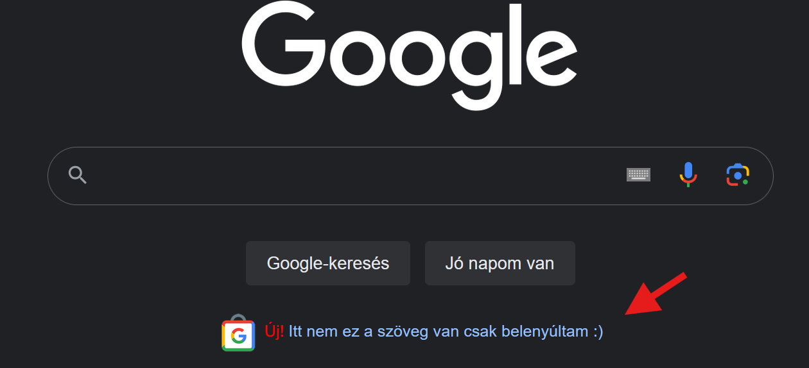

# Válasszunk nyelvet
Egy nyelv választás fontos tényező is lehet, ha ilyen-olyan emberek felerősített hangjaira hallgat és nem szakember mondja meg az irányt. Az utóbbi is tévesnek ítélem meg, mert ne egy random ember mondja meg, hogy mit szeretne tanulni a tanuló. Én se és más se lát bele másnak a fejébe, hogy mit képzelt el. Legrosszabb esetben a kedvét is elveszítheti. Ezért, én bemutatom a környezetet, hogy mik a jelenleg használtak vagy aktívan tanult nyelvek. Melyik nyelv mire jó.

Amúgy megsúgom, hogy a legtöbb nyelv [Turing](https://hu.wikipedia.org/wiki/Turing-g%C3%A9p)-teljes. Azaz, minden megvalósítható benne, mint a másikban. Tehát, nem is maga a nyelv lesz a kérdés, hanem a nyelv köré épített és hozzáadott bővítések (könyvtárak) és maga a nyelv viselkedési jellemzője.

Máshogy működik és máshogyan kell használni egy Java nyelvet, mint egy Go-t, még ha ugyanazt is szeretnéd megvalósítani. Tehát, úgy tudnám összehasonlítani, mint A-ból B-be mennél, de egyszer autót használsz utazáshoz, máskor meg egy motort. A KRESZ szabályok 95%-ban ugyanaz, csak a használt eszköz más.

Igen, hogy meglepő legyen az [Excel is Turing-teljes](https://prog.hu/hirek/5648/turing-teljes-lett-az-excel-o-lehet-az-uj-legnepszerubb-programozasi-nyelv) lett... :raised_eyebrow: Tehát, papíron weboldal-t is lehetne benne írni. Az már, másik kérdés, hogy mennyire alkalmas rá. :)

## Nyelv választás
Nézzük a [StackOverflow - 2024 Developer Survey](https://survey.stackoverflow.co/2024)-t, hogy mik a használt nyelvek és a népszerűek tanulás szempontból. Szeretném kiemelni, hogy nem a TOP-lista szerint fogok választani nyelveket!

Ha megnézzük a nyelveket, [amikben szakemberek fejlesztenek](https://survey.stackoverflow.co/2024/technology#most-popular-technologies-language-prof) látjuk, hogy eléggé eltér a [tanuló nyelvektől](https://survey.stackoverflow.co/2024/technology#most-popular-technologies-language-learn).

### Fejlesztők által használt

Így ránézve megtévesztő egy összehasonlítási alap. Miért? A fejlesztők ~64%-a használja a `JS` JavaScript-et. Ennek azaz oka, hogy a legtöbb felület beleértve ez az oldal is `JS`-eket futtat. Böngészők eredetileg nem is nagyon tudnak mást. _(Most a WebAssembly-re nem térek ki.)_ Így aki úgynevezett `FrontEnd` fejlesztő szeretne lenni (amit a felhasználó lát), számára a `JS` ismerete majd-hogy-nem elengedhetetlen. Így ebből a kötelezőségből, a `JS` nyelvre felhajtó erőként hat.

[//]: # (TODO: NoSQL-ről írni)
Az [SQL](https://hu.wikipedia.org/wiki/SQL) is hasonló cipőben jár csak `BackEnd` azaz szerver oldalon. Azért van rá szükség, mert ezzel a nyelvezettel lehet kommunikálni a relációs adatbázisokkal. ([Több termék is van.](https://db-engines.com/en/ranking/relational+dbms)) Angolul **D**ata**b**ase, röviden csak `DB`. Az adatbázisok arra használatosak, hogy hosszú távon tároljunk adatokat strukturált formában, hasonlóan a HDD vagy SSD-hez a saját fájljaidat vagy bármit amit lementenél. Ahogy a számítógépet kikapcsolod a nem lementett adatok elvesznek. Ez igaz a programokra is mikor leállnak, de ezt tapasztaltad már gondolom.

Szorosan követi a `HTML/CSS`. Hát ez egy kakukk tojás... :sweat_smile: A `HTML` és a `CSS` egy [leíró dokumentum](https://hu.wikipedia.org/wiki/HTML), nem pedig programozási nyelv. `HTML` a felület strukturáját adja, míg a `CSS` annak stílusát. Ha megnyitsz egy tetszőleges oldalt egy böngészőben `F12`-vel előtudod hozni a "vizsgálat"-ot, ahol megtudod nézni hogy épül fel az oldal. Ha bele nyúlkálsz az oldal is változik annak megfelelően. Ezzel lehet azt a látszatot kelteni, hogy pl. egy hír rólad szól vagy átírod a tartalmat, képet készítesz róla és ijesztgetsz másokat... De a valós tartalom ezzel nem változik. Egy oldal frissítéssel vissza áll az eredeti formájára.

A `PY`, ami a `Python` és a többi nyelv, már közelebb áll a valósághoz, mármint a program nyelvekhez és persze az első helyezett a `JS` is az.

### Nyelvek amit tanulnak

Látszik, hogy most mindenki a `Python`-ra izgul. Ez nem véletlen és több oka van. Egyrészt a `Python` egy univerzális nyelv (köhöm.. a többi is az), amit viszonylag könnyű elsajátítani és sokan is ajánlgatják. Továbbá [BigData](https://lexunit.hu/blog/mi-az-a-big-data-es-mire-hasznaljuk/) szakirányban vagy `AI` azaz mesterséges intelligencia körökben is sűrűn használt a kiforrott eszközei miatt, mint más nyelv.

Ennek ellenére, miért nem ajánlom mégse kezdő nyelvnek? Mert nem fekteti le az alapokat, hanem azokat átvállalja, elrejti, leegyszerűsíti és így csábít át a "sötét oldalra", hogy azokat ne is tanuld meg. (Most jó sok ellenséget szereztem magamnak... :D) Ha ragaszkodsz hozzá, akkor úgy is ezzel fogsz kezdeni. Ez a te döntésed. Persze a `Python`-t is előveszem, mikor majd algoritmusokat nézünk. Fogjuk használni. :wink:

Ha csak azért akarsz Python-ozni, mert megfogott a `AI hype`, itt lekopogom, hogy gyorsan falnak fogsz ütközni. Számos követelménye van az AI fejlesztésnek. Először a programozási alapok legyenek meg, ezután legyél tisztában az algoritmusokkal és adatszerkezetekkel. Ez után vagy párhuzamosan ismerd meg a lineáris algebrát, valószínűségszámítást és statisztikát. Mivel adatokkal kell foglalkozni, így a matematikai alapokkal adatfeldolgozás és adatkezelés módszerek ismereteinek elsajátítására lesz szükséged. Aztán gyakorolhatsz a `NumPy`, `TensorFlow` és egyéb könyvtárakkal. Persze további szakirodalom olvasás sem árt, hogy mi az a `Deep Learning` vagy a `Neural Network`. Hosszú az ide vezető út.

A `HTML/CSS` és a `JS`-ről már meséltem. Azonos az aránya is ~60.4%, mert össze függ. FrontEnd, felhasználói felület ugye.

### Egyéb statisztikák, források
Tapasztalt szakemberek is folyamatosan kutatják, hogy melyik technológia, hogy fejlődik és melyik milyen problémára alkalmas. Itt fontos megemlítenem és egyben legyen alap tétel is, hogy problémára választunk eszközt/nyelvet, nem pedig egy nyelvel akarjunk mindent megoldani. Az utóbbi nem lesz optimális, azaz túlsok időt, energiát és pénzt éget el. Tehát, azaz ember "sikeres", aki kevesebb energia befektetéssel jobb eredményt tud előállítani. A kóklerek ki fognak hullani.

> [!WARNING] Alap megközelítés
> Problémára választunk eszközt! Vagy magadat szivatód vele.

Ha gondolod meghazudtolhatsz. Én megengedem, hogy hugyozz széllel szemben.

#### StackOverflow Trends Chart

A StackOverflow egy szakmai gyakorikérdések lényegében. Minden féle nyelvvel, technológiával kapcsolatban van kérdés fejlesztői és üzemeltetői oldalon. Amit most hoztam nektek az egy aktivitási, kérdés feltevési ábra, hogy hónapról hónapra egyes nyelvekkel kapcsolatban hogyan alakult a kérdés szám a StackOverflow-n az összes kérdéshez arányosítva.
Ebből is kikövetkeztethető, hogy világ szinten melyik nyelv van inkább használva vagy kísérletezés alatt.
Itt leolvasható, hogy:
-	2023 eleje fele van egy beszakadás a top nyelvekkel kapcsolatban. Vagy a kirúgási hullám miatt nincs annyi aktív munkavállaló, akinek lenne oka keresgélni? Vagy a [GitHub Copilot](https://github.com/features/copilot) kiváltotta a StackOverflow keresések egy részét?
-	Python 2012 óta emelkedik, olyan 2023 fele beszakad. Az előző pont lehet az oka vagy egyszerűen bedőltek az AI StartUp cégek?
-	C# és a Java azért arányosan mozog.
-	C nyelv az nem inog meg. Bármi történjék is. Stabilan mennek a kérdések.

A StackOverflow vannak egyéb aloldalai, amik operációs rendszerrel foglalkozik például.

Ha régi lenne a kép, [itt](https://trends.stackoverflow.co/?tags=java,c,python,c%23,javascript,assembly,php,go,c%2B%2B,rust) a keresett link.

#### Google Trends
A [Google Trends](https://trends.google.com/trends/explore) is hasonló, csak itt a Google keresésekből lehet statisztikát lekérni. Sajnos nem enged annyi keresési tételt, mint a StackOverflow, de ez is egy jó kiinduló alap. Nyugodtan másszatok fel rá, és nézelődjetek.

Hoztam innen is 2 képet. Az egyik Magyarországon rákeresett nyelvek, míg a másik a világszerte. Plusz, ha beállítok egy kategóriát a magyar vonalra, máris a Java nyelv kerül első helyre.

#### Salary Guide-ok
A `Salary Guide`, magyar "bér iránytű" is amolyan piaci elemzés és fizetések össze-matekozása. Nem csak a – szerintük - elérhető fizetéseket osztják meg, hanem a piaci helyzetet. Itt most hozok 3 oldalt
-	[BlueBird](https://bluebird.hu/) egy fejvadász cég, de ők is évente közzé teszik a saját tapasztalataikat évente, olyan év vége felé.
-	[Hays](https://www.hays.hu/) is ilyen téren mozog ugyanilyen intervallummal, de inkább tavasz magasságában publikálják a sajátjukat
-	Amit [itt](https://techfizu.robi.dev/) találtok, ez pedig a Hays-nek amolyan fizetési összesítője évekre bontva, hogy lehessen követni a változásokat.

Mivel a jelen pillanatban a Hays a legfrisebb (amiről tudok) így annak a piaci elemzését vágom most ide be.
Előre is elnézést kérek, hogy így ide copy-zom.

**Forrás:** Hays Salary Guide 2024 [letölhető PDF](https://www.hays.hu/documents/63283/61549493/HU+SG24+Digital+01+2024+secured.pdf)

> A covidot követő toborzáscunami után 2023 óriási hullámvölgyet hozott a teljes munkaidős munkavállalók felvételében az IT területén. A kulcsszavak a stabilitás, kivárás és megtartás voltak, és egyelőre nem látni, hogy ez 2024-ben drasztikusan változna. A toborzás lassulása mellett alábbhagyott a bérek évek óta tartó dinamikus emelkedése is. Sok esetben nem nőttek a bérek, de volt szakterület, ahol némileg csökkentek is. Mindez főként a munkaerőigény csökkenésének tudható be, és hogy a leépítések nyomán felszabadult jelöltek nem találtak állást, illetve akik váltani akartak, kevés lehetőség közül válogathattak. Az évek óta jelöltvezérelt piac hirtelen pozícióvezéreltté alakult.
>
> <h3>IPARÁGI TRENDEK</h3>
>
> <h4>A csapból is az AI folyt</h4>
>
> Kétségtelen, hogy a mesterséges intelligencia témája meghatározta a 2023-as évet. Az egyre magasabb szintű technológiát tömegesen kezdték el használni a vállalatok, a szakemberek és a lakosság is. Habár a mesterséges intelligencia a mindennapokban eddig is velünk volt, illetve számos ilyen jellegű fejlesztés zajlott folyamatosan, mégis idén történt meg a nagy áttörés. Ma már a legtöbb szakmai fórumon legalább említés szintjén biztosan szóba kerül az AI, és ez várhatóan 2024-ben is így lesz.
>
> <h4>Fókuszban a felhő és a DevOps-mérnökök</h4>
>
> A vállalatok életében továbbra is meghatározó a cloud technológia és annak elterjedése. Ez a trend évek óta velünk van és velünk is marad, mert előbb-utóbb minden vállalat felhőalapú technológiákat fog használni. Azonban mivel ez a szakterület még mindig nagyon új, a jelöltek száma továbbra is limitált. Változatlanul nagyon keresettek a valamely cloud technológiában tapasztalt DevOps-mérnökök, akik átlagosan 70%-ban fejlesztéssel és 30%-ban üzemeltetéssel foglalkoznak.
>
> <h4>A szoftverfejlesztőknél a fullstack az aduász</h4>
>
> A vállalatok nagyon sok mindent megadnak ma az igazán jó fullstackes szakemberekért, akik minden bizonnyal a közeljövőben is nélkülözhetetlenek lesznek. A széles körű programozói kompetenciák mindig is versenyképesek voltak, de ezen a szakterületenmég a többihez képest is kiemelten fontos a rutin. Az igazán értékes fullstackes – egyszerre backend és frontend oldali szoftverfejlesztői – tudáshoz legalább 5 éves szakmai tapasztalat szükséges a jelölt oldaláról.
>
> <h3>POZÍCIÓK</h3>
>
> 2023-ban, és az iparági trendeket figyelembe véve várhatóan 2024-ben is **a legkeresettebb pozíciók** a Fullstack Developer és DevOps Engineer lesznek a szektorban.
> - **A legjobban fizető** pozíciók a szoftverfejlesztői szakterületen vannak, azon belül is a frontend, a Python és a Java technológiákkal dolgozó szakemberek keresnek a legjobban.
> - **A leginkább elérhető** szakemberek jelenleg a tesztelési, infrastruktúra és projektmenedzsment szakterületen vannak.
> - **A legkevésbé elérhetők** a tapasztalt DevOps-mérnökök, Salesforce-szakemberek, datával foglalkozó szakemberek, Python-fejlesztők és Node.js-fejlesztők.
>
> <h3>TOP 3 TREND 2024-BEN</h3>
>
> 1. Minden bizonnyal több IT-fejlesztési projekt lesz 2024-ben, mint az előző évben, de mérsékelt lesz a növekedés. Ha 2022 az IT-toborzás éve volt, akkor 2023 annak az ellentéte. Valahol a kettő között lesz a megoldás, de közelebb a 2023-as évhez.
> 2. A bérek várakozásaink szerint infláció alatti mértékben fognak növekedni 2024-ben is, annak ellenére, hogy a jelöltek nagy vágya, hogy inflációkövető fizetésemelést kapjanak évről évre.
> 3. A vállalati oldalon a megtartás várhatóan továbbra is prioritás lesz. A kulcspozícióban lévő és igazán jó jelölteknek jobb tárgyalási alapjuk lesz, és ezáltal az ellenajánlatok nem csak velünk maradnak, még többre számítunk

#### Technology Radar
Ez a rész, kevésbé tartozik ide ezért is tettem így a végére, de fontos, ha technológiát vagy eszközt kellene választani és ahelyett, hogy magad kísérletezd ki, ezt megteszik mások is. [Ezen](https://www.thoughtworks.com/radar) az oldalon lehet követni mik léteznek és miket érdemes használni vagy szintúgy kipróbálni, hát ha beválik vagy megtetszik. De előre szólok. Itt MINDEN is van.

Rövid leírás róluk:
> A Thoughtworks Technology Radar egy félévente frissülő ismeretmegosztó eszköz, amely a technológiai környezetet mutatja be. Az alábbiakat tartalmazza:
>
> - Technikák: Az aktuális projektek során felfedezhető technikákat.
> - Platformok: Különböző platformokat és keretrendszereket.
> - Eszközök: Hasznos eszközöket.
> - Nyelvek és keretrendszerek: Programozási nyelveket és keretrendszereket.
>
> Minden elemet egy "blip" képvisel, és négy kategóriába sorolják őket:
>
> 1. Adoptálás: Olyan blippek, amelyeket érdemes komolyan fontolóra venni.
> 2. Tesztelés: Olyan dolgok, amelyek használhatók, de még nem teljesen bizonyítottak.
> 3. Értékelés: Olyan elemek, amelyeket érdemes megvizsgálni, de még nem feltétlenül tesztelni.
> 4. Óvatosság: Vigyázat, ezekkel óvatosan kell bánni.
>
> A Radar segít a projektek során felfedezni az új lehetőségeket és a bevált módszertanokat.

## Nyelvek
Az alábbi nyelvek leírását `ChatGPT`-vel generáltattam, ellenőriztem és ismereteim alapján korrigáltam. Tévedések előfordulhatnak benne, ha találsz még is jelezd nekem.

Számos más nyelvet nem említettem, mint pl.
- `SQL`, mert az relációs adatbázis nyelvezete, amivel minden esetben fogsz találkozni bármelyik nyelvet is válaszd.
- A `Bash/Shell` linux vagy macOS rendszerek script nyelvei, de annak is számos variánsa is van (pl. `csh`, `ksh`, `zsh`). Linux rendszereknél fogjuk elővenni.

Programozás alapok avagy kezdő szintnél mindegyiket kézbe fogom venni.

### C
A C programozási nyelvet az 1970-es évek elején fejlesztette ki Dennis Ritchie a Bell Labs-nál. Ez egy általános célú, magas szintű nyelv, amely a hardverközeli programozásra is alkalmas, és azóta számos modern programozási nyelv alapjául szolgált.

A C nyelv jellemzői közé tartozik a gyors és hatékony kód, amely lehetővé teszi nagy teljesítményt igénylő alkalmazások készítését. Emellett a nyelv szintaxisa egyszerű, de rugalmasságot biztosít a programozónak, valamint lehetővé teszi a programok könnyű portolását különböző platformokra. C-ben különféle programokat lehet írni, beleértve operációs rendszereket, beágyazott rendszereket _(azaz robot porszívók, okos hűtők, ... mindenre amire "okos" szó ráhúzgató)_, alkalmazásokat, hálózati programokat, és fordítókat.

### C++
A C++ programozási nyelvet Bjarne Stroustrup fejlesztette ki az 1980-as évek elején, a C nyelv kiterjesztéseként. A C++ megőrzi a C nyelv hatékonyságát, miközben új, magasabb szintű programozási eszközöket biztosít, mint például az objektumorientált programozás támogatása.

A C++ egyik fő jellemzője az objektumorientáltság, amely lehetővé teszi az adatok és funkciók osztályokba és objektumokba szervezését. Emellett a C++ támogatja a generikus programozást is (de hívja `template`-nek is), amely rugalmasabb és újra felhasználhatóbb kódot eredményez. A nyelv szintaxisa a C-hez hasonló, de több kényelmi funkcióval bővült, például a kivételkezeléssel és a dinamikus memóriakezeléssel.

A C++-t széles körben használják különféle területeken, mint például játékfejlesztés (így [Unreal Engine](https://dev.epicgames.com/documentation/en-us/unreal-engine/programming-with-cplusplus-in-unreal-engine) is), szoftverfejlesztés, grafikai -, és nagy teljesítményű számítástechnikai alkalmazások. Ez a nyelv ideális választás, ha hatékony, mégis rugalmas megoldásokat szeretnénk fejleszteni, és a C nyelv ismeretével rendelkező programozók számára természetes tovább fejlődést kínál.

### Rust
A Rust programozási nyelvet 2006-ban kezdték el fejleszteni és 2010-ben mutatta be Mozilla Research, és 2015-ben adták ki hivatalosan. Rustot úgy tervezték, hogy biztonságos és hatékony legyen, különösen a memóriakezelés terén, miközben magas szintű programozási lehetőségeket kínál. A nyelv célja a C és C++ nyelvek teljesítményének és rugalmasságának megtartása, de biztonságosabb formában.

Rust egyik fő jellemzője a memória biztonság, amelyet a nyelv tulajdonlási rendszerén keresztül biztosít. Ez a rendszer megakadályozza a null pointer és versenyhelyzetek kialakulását, anélkül, hogy szükség lenne egy szemétgyűjtő (garbage collector) használatára. Emellett Rust támogatja a párhuzamos programozást és a makró alapú metaprogramozást is, amelyek segítségével hatékony és biztonságos kódot lehet írni.

Rustot széles körben használják rendszerszintű programozásra, például operációs rendszerek és beágyazott rendszerekben is. Mindezek mellet támogatja a webfejlesztést is.

### Go
A Go programozási nyelvet (vagy GoLang) a Google fejlesztette ki 2007-ben, és 2009-ben mutatták be hivatalosan. A nyelv célja, hogy egyszerű, hatékony és könnyen olvasható legyen, miközben modern megoldásokat kínál a nagy méretű, elosztott rendszerek számára.

Go egyik fő jellemzője az egyszerűség és a tiszta szintaxis, amely megkönnyíti a kód olvashatóságát és karbantartását. A nyelv beépített párhuzamossági támogatást kínál a gorutinok révén, amelyek lehetővé teszik a könnyű, de hatékony párhuzamos programozást. Emellett a Go gyors fordítási idővel rendelkezik, annak ellenére, hogy szemétgyűjtővel (garbage collector) is rendelkezik, amennyiben szükség van rá.

A Go nyelvet elsősorban szerveroldali alkalmazások, mikroszolgáltatások, és felhőalapú infrastruktúrák fejlesztésére használják. A nyelv ideális választás olyan projektekhez, ahol a skálázhatóság, a párhuzamosság és az egyszerűség kulcsfontosságú, és egyre népszerűbbé válik a modern szoftverfejlesztési ökoszisztémában.

### Java
A Java programozási nyelvet 1995-ben mutatta be a Sun Microsystems (ma az Oracle tulajdona), és azóta az egyik legnépszerűbb nyelvvé vált a világon. A Java-t úgy tervezték, hogy platformfüggetlen legyen, így a "Write Once, Run Anywhere" (írj meg egyszer, futtasd bárhol) elvet követi, ami azt jelenti, hogy a Java-ban írt programok különböző rendszereken is futtathatók változtatás nélkül.

Java egyik fő jellemzője az objektumorientált programozás támogatása, amely lehetővé teszi a kód modularitását és újra felhasználhatóságát. Emellett Java rendelkezik egy szemétgyűjtővel (garbage collector), amely automatikusan kezeli a memóriát, így csökkentve a memóriaszivárgások kockázatát. A Java szintaxisa C++ alapú, de egyszerűbb és biztonságosabb, mivel például nem támogatja a közvetlen memóriakezelést pointerekkel.

A Java nyelvet széles körben használják vállalati alkalmazások, mobil alkalmazások (különösen Android), webalkalmazások, és nagy teljesítményű szerveroldali rendszerek fejlesztésére. A Java megbízhatósága, skálázhatósága és a hozzá tartozó kiterjedt ökoszisztéma miatt a nyelv ideális választás komplex, hosszú távú projektekhez.

### Kotlin
A Kotlin programozási nyelvet a JetBrains fejlesztette ki, és 2011-ben jelent meg először. Kotlin egy modern, általános célú nyelv, amelyet úgy terveztek, hogy egyszerre legyen biztonságos, kifejező és kompatibilis a már meglévő Java ökoszisztémával. A nyelv különösen népszerűvé vált az Android fejlesztésben, miután 2017-ben a Google hivatalosan is támogatta Android fejlesztési nyelvként.

Kotlin egyik fő jellemzője a tömör és olvasható szintaxis, amely csökkenti a kód mennyiségét, miközben növeli a kód biztonságát és karbantarthatóságát. A nyelv olyan modern funkciókat kínál, mint a nullbiztonság, a kiterjesztési függvények és a magas szintű funkcionális programozási lehetőségek. Kotlin teljesen interoperábilis a Java-val, ami azt jelenti, hogy Java kódot és könyvtárakat zökkenőmentesen lehet használni Kotlin projektekben, valamint Kotlin kódot is be lehet ágyazni meglévő Java alapú rendszerekbe.

Kotlin széles körben használatos Android alkalmazások fejlesztésében, de a szerveroldali fejlesztés, webfejlesztés és desktop alkalmazások területén is egyre népszerűbb. A nyelv ideális választás mind új projektekhez, mind pedig meglévő Java projektek modernizálásához, mivel kombinálja a modern programozási nyelvek előnyeit a Java széles körű támogatottságával és stabilitásával.

### Python
A Python programozási nyelvet Guido van Rossum fejlesztette ki, és 1991-ben jelent meg először. Python-t úgy tervezték, hogy könnyen olvasható és tanulható legyen, miközben erőteljes és sokoldalú megoldásokat kínál a programozás különböző területein. A nyelv egyszerű szintaxisa és nagyfokú olvashatósága miatt különösen népszerű mind kezdők, tapasztalt fejlesztők és kutatók körében.

Python egyik fő jellemzője a dinamizmus és az értelmezett (interpreted) természet, ami azt jelenti, hogy a kódot futtatás közben értelmezi a Python fordító, és nincs szükség előzetes fordításra. Ez gyors fejlesztési ciklusokat tesz lehetővé. A nyelv gazdag standard könyvtárai és a hatalmas közösségi támogatás révén Python alkalmas szinte bármilyen típusú alkalmazás fejlesztésére, a webfejlesztéstől kezdve az adatelemzésen át a mesterséges intelligenciáig.

A Python nyelvet széles körben használják különféle területeken, beleértve a webfejlesztést, adatelemzést, tudományos számításokat, automatizálást, és a mesterséges intelligenciát. A nyelv egyszerűsége és rugalmassága, valamint az erős közösségi támogatás miatt Python ideális választás mind gyors prototípusok készítéséhez, mind pedig nagy skálájú, komplex projektek fejlesztéséhez.

### PHP
A PHP (Hypertext Preprocessor) programozási nyelvet Rasmus Lerdorf fejlesztette ki 1994-ben, és elsősorban dinamikus weboldalak és webalkalmazások készítésére tervezték. A PHP eredetileg egy egyszerű eszközkészletként indult, de az évek során egy teljes értékű szerveroldali programozási nyelvvé fejlődött, amelyet széles körben használnak a webfejlesztésben.

PHP egyik fő jellemzője, hogy közvetlenül beágyazható HTML kódba, ami megkönnyíti a dinamikus tartalmak létrehozását és a szerveroldali logika kezelését. A nyelv egyszerű és gyorsan elsajátítható, ami különösen vonzóvá teszi a kezdő fejlesztők számára. Emellett a PHP számos beépített függvényt és könyvtárat kínál, amelyek megkönnyítik a webes műveleteket, mint például adatbázis-kezelést, fájlkezelést, és form-kezelést.

A PHP nyelvet elsősorban weboldalak és webalkalmazások fejlesztésére használják, és számos népszerű tartalomkezelő rendszer, például a WordPress, a Drupal, és a Joomla is PHP alapú. A nyelv kiváló választás mind egyszerű, mind összetett webprojektekhez, köszönhetően széles körű támogatottságának és a hozzá tartozó kiterjedt ökoszisztémának.

### JavaScript / TypeScript
> [!WARNING]
> Nem összekeverendő a Java a JavaScript-el!!!

A JavaScript programozási nyelvet Brendan Eich fejlesztette ki 1995-ben, és azóta az egyik legfontosabb nyelvvé vált a webfejlesztésben. JavaScript egy kliensoldali szkriptnyelv, amelyet elsősorban interaktív és dinamikus weboldalak létrehozására használnak, de a Node.js megjelenésével szerveroldali fejlesztésre is alkalmassá vált.

JavaScript egyik fő jellemzője a rugalmasság és a könnyű beépíthetőség a HTML-be, ami lehetővé teszi a weboldalak viselkedésének és megjelenésének dinamikus módosítását. A nyelv aszinkron programozási képességei, például az ígéretek (promises) és az async/await funkciók, hatékonyan kezelik a hálózati műveleteket és más időigényes feladatokat. JavaScriptet széles körben támogatják a böngészők, és rengeteg könyvtár és keretrendszer (pl. React, Angular, Vue.js) épül rá, amelyek megkönnyítik a fejlesztést.

A TypeScript, amelyet a Microsoft fejlesztett ki, a JavaScript egy típusos szupersetje, amely hozzáad statikus típusellenőrzést és egyéb fejlett programozási eszközöket. A TypeScript célja, hogy a nagyobb és bonyolultabb projektek fejlesztését biztonságosabbá és kezelhetőbbé tegye, miközben teljes mértékben kompatibilis marad a JavaScript-tel. A TypeScript különösen népszerű a nagyobb alkalmazások fejlesztésében, mivel segít elkerülni a típushibákat és elősegíti a kód karbantarthatóságát.

### HTML és CSS
A HTML (Hypertext Markup Language) és a CSS (Cascading Style Sheets) a webfejlesztés alapvető technológiái, amelyek a weboldalak szerkezetét és megjelenését határozzák meg.

**HTML**, a weboldalak szerkezetének alapját képezi, és lehetővé teszi a szövegek, képek, hivatkozások és egyéb tartalmak strukturált megjelenítését a böngészőkben. HTML egy jelölőnyelv, amely címkéket (tags) használ a dokumentum elemeinek azonosítására és szervezésére, például `<h1>`, `
`, `<a>`, és ``. Az HTML5 verzió új elemeket és API-kat is bevezetett, amelyek javítják a multimédiás tartalmak kezelését és a webalkalmazások funkcionalitását.

**CSS** a HTML elemek megjelenésének és elrendezésének szabályozására szolgál. CSS lehetővé teszi a weboldalak stílusának, színének, betűtípusának és elrendezésének testre szabását anélkül, hogy a HTML szerkezetét módosítani kellene. A CSS használata révén a webfejlesztők rugalmasan és hatékonyan alakíthatják ki a weboldalak kinézetét, például a rácsok (grid) és flexbox rendszerek segítségével, valamint média lekérdezésekkel (media queries) alkalmazkodhatnak különböző képernyőméretekhez.

A HTML és CSS kombinációja lehetővé teszi az interaktív és vizuálisan vonzó weboldalak létrehozását. Míg a HTML a weboldalak tartalmát és struktúráját biztosítja, addig a CSS a megjelenést és a dizájnt kezeli. Erre épül rá a már említett JavaScript, ami dinamikussá teszt azt.

## Válasszunk!

Hát, akkor válasszunk nyelvet. Nem lesz egyszerű. Ha nem olvastátok el a Hays POZÍCIÓK részét, akkor most ide bevágom.

> 2023-ban, és az iparági trendeket figyelembe véve várhatóan 2024-ben is **a legkeresettebb pozíciók** a Fullstack Developer és DevOps Engineer lesznek a szektorban.
> - **A legjobban fizető** pozíciók a szoftverfejlesztői szakterületen vannak, azon belül is a frontend, a Python és a Java technológiákkal dolgozó szakemberek keresnek a legjobban.
> - **A leginkább elérhető** szakemberek jelenleg a tesztelési, infrastruktúra és projektmenedzsment szakterületen vannak.
> - **A legkevésbé elérhetők** a tapasztalt DevOps-mérnökök, Salesforce-szakemberek, datával foglalkozó szakemberek, Python-fejlesztők és Node.js-fejlesztők.

Most a Python adná magát, hogy az egy jó irány, mint a StackOverflow felméréséből vagy trendekből. DE! Itt van a kutya elásva. Te alapítanál ott egy céget, amire nem találsz embert magad mellé? Nem mi? Inkább oda mész, ahol van olyan tudás. Ugye? Ha, "legkevésbé elérhető" kategória a Python, akkor miért? Ha körbe nézel Magyarországon Python pozíciók után, azt kell, hogy mondjam: nem bőségeskedik lehetőségekben. Külföldi adatokat nem ismerek, de lehet, hogy ott jobban megy a Python szekere. AI-ban, BigData-ban vagy Linux üzemeltetésben biztos használnád itthon is.

Ha legjobban fizető témát nézzük, akkor a Python mellet marad a Java és a FrontEnd.

Maga a választás nem egyszerű. De, nem is mondom, hogy most kell választani. Úgy is úgy terveztem, hogy az oktató vagy ismeret terjesztő oldalamon több nyelvet veszek elő és párhuzamosan tanuljuk őket, míg ténylegesen el nem ágaznak a nyelvi egyediségei miatt. Egyébként, ha egy nyelvet megtanultál ténylegesen, onnantól olyan nagy különbség nem lesz a másik nyelvvel kapcsolatban.

> [!INFO]
> Amúgy a Rust nyelvet én se ismerem. Ezen oldal írásával egybe terveztem megtanulni.

Mobil alkalmazás fejlesztésbe nem fogok belemenni, de az már csak egy ugrás lenne. Android esetén a Kotlin kell meg az Android környezete. iOS esetén a Swift nyelv, amit nem fogunk venni, de ettől függetlenül nem zárlak el az iOS-től.

Ha mobilon gondolkozol, akkor JavaScript/TypeScript minden képen a te barátod lesz. Mert? Van az úgy nevezett platform független rendszerek, azaz "többnyire" elég 1x megírni és mehet Android-ra és iOS-re. Ha Kotlinnal és Switft-el csinálnád, akkor 2x kellene megírni ugyanazt platform függő módon.

Platform független rendszerek:
- [React Native](https://reactnative.dev/): a React keretrendszert használja és mobil-ra építi fel az alkalmazást.
- [Ionic](https://ionicframework.com/): egy böngészős "webes" réteget képez, amin kb. bármit tudsz futtatni mint a böngészőben.
- [Flutter](https://flutter.dev/): Ez egy kakuk tojás, mert Dart nyelvet használ.
