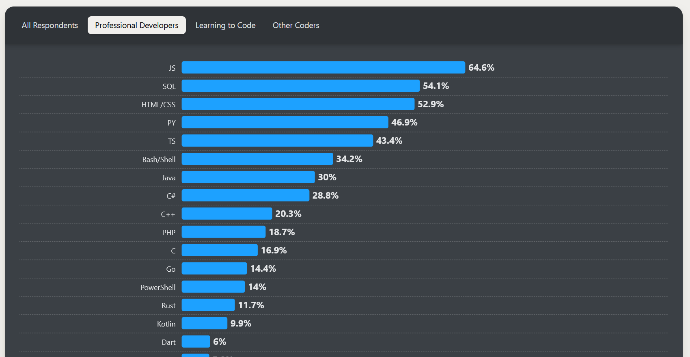
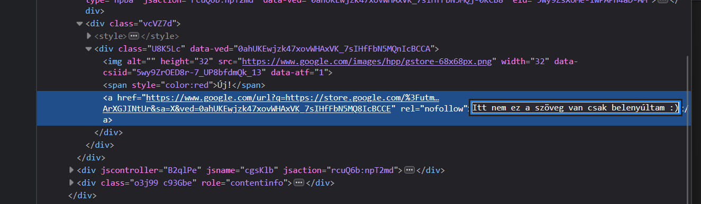
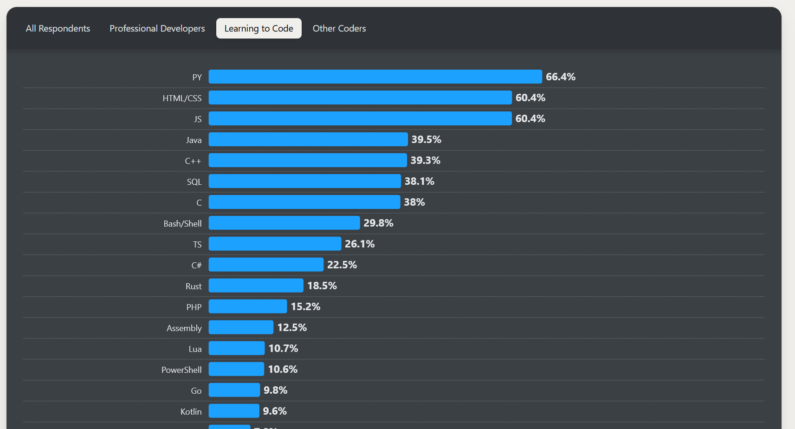

# Első lépés
A szoftver fejlesztés számos tudomány ágból tevődik össze. Nyilván neki lehet vágni ezen ismeretek hiányában is és sikerélményeket begyűjteni. Csak ne száljon fejbe a dicsőség. Nem egyszer látom olyat - főleg a kezdők esetén -, hogy végig mentek egy YouTube tutoriálon és máris azt hiszik, hogy pro-k. Nyilván ez olyan tekintetben helytálló, hogy ez elött nem tudott semmit, így ez egy nagy ugrás részéről. :) De erről írtam [itt, hogy Ne es ebbe a hibába!](/tan-osveny/bevezetes/nehez-szakma.html#ne-es-ebbe-a-hibaba).

[//]: # (TODO: Írni a linuxról)
Az IT-ban a programozási ismeret egy alapvető dolog, ahogy a Linux rendszer ismerete is. Linux-ról késöbb fogok írni.

> [!NOTE]
> Mindig lesz nálad jobb vagy okosabb szakember, akármilyen szakmát is űzől és mennyi ideje.

## Mit használjunk?

### Nyelv választás
Nézzük a [StackOverflow - 2024 Developer Survey](https://survey.stackoverflow.co/2024)-t, hogy mik a használt nyelvek és a népszerűek tanulás szempontból. Szeretném kiemelni, hogy nem a TOP-lista szerint fogok választani nyelveket!

Ha megnézzük a nyelveket, [amikben szakemberek fejlesztenek](https://survey.stackoverflow.co/2024/technology#most-popular-technologies-language-prof) látjuk, hogy eléggé eltér a [tanuló nyelvektől](https://survey.stackoverflow.co/2024/technology#most-popular-technologies-language-learn).

#### Fejlesztők által használt

Így ránézve megtévesző egy összehasonlítási alap. Miért? A fejlesztők ~64%-a használja a `JS` JavaScript-et. Ennek azaz oka, hogy a legtöbb felület beleértve ez az oldal is `JS`-eket futtat. Böngészők eredetileg nem is nagyon tudnak mást. _(Most a WebAssembly-re nem térek ki.)_ Így aki úgynevezett `FrontEnd` fejlesztő szeretne lenni (amit a felhasználó lát), számára a `JS` ismerete majd-hogy-nem elengedhetetlen. Így ebből a kötelezőségből, a `JS` nyelvre felhajtó erőként hat.

[//]: # (TODO: NoSQL-ről írni)
Az [SQL](https://hu.wikipedia.org/wiki/SQL) is hasonló cipőben jár csak `BackEnd` azaz szerver oldalon. Azért van rá szükség, mert ezzel a nyelvezettel lehet kommunikálni a relációs adatbázisokkal. ([Több termék is van.](https://db-engines.com/en/ranking/relational+dbms)) Angolul **D**ata**b**ase, röviden csak `DB`. Az adatbázisok arra használatosak, hogy hosszú távon tároljunk adatokat struktúrált formában, hasonlóan a HDD vagy SSD-hez a saját fáljaidat vagy bármit amit lementenél. Ahogy a számítógépet kikapcsolod a nem lementett adatok elvesznek. Ez igaz a programokra is mikor leállnak, de ezt tapasztaltad már gondolom.

Szorosan követi a `HTML/CSS`. Hát ez egy kakukk tojás... :sweat_smile: A `HTML` és a `CSS` egy [leíró dokumentum](https://hu.wikipedia.org/wiki/HTML), nem pedig programozási nyelv. `HTML` a struktúrát adja, míg a `CSS` annak stílusát. Ha megnyitsz egy tetszőleges oldalt egy böngészőben `F12`-vel előtudod hozni a "vizsgálat"-ot, ahol megtudod nézni hogy épül fel az oldal. Ha bele nyúlkálsz az oldal is változik annak megfelelően. Ezzel lehet azt a látszatot kelteni, hogy pl. egy hír rólad szól vagy átírod a tartalmat, képet készítesz róla és ijeszgetsz másokat... De a valós tartalom ezzel nem változik. Egy oldal frissítéssel vissza áll az eredeti formájára.

A `PY`, ami a `Python` és a többi nyelv, már közelebb áll a valóságoz, mármint a program nyelvekhez és persze az első helyezett a `JS` is az.

#### Nyelvek amit tanulnak

Látszik, hogy most mindenki a `Python`-ra izgul. Ez nem véletlen és több oka van. Egyrészt a `Python` egy univerzális nyelv (köhöm.. a többi is az), amit viszonylag könnyű elsajátítani és sokan is ajánlgatják. Továbbá [BigData](https://lexunit.hu/blog/mi-az-a-big-data-es-mire-hasznaljuk/) szakirányban vagy `AI` azaz mesterséges intelligencia körökben is sűrűn használt a kiforrott eszközei miatt, mint más nyelv.

Ennek ellenére, miért nem ajánlom mégse kezdő nyelvnek? Mert nem fekteti le az alapokat, hanem azokat átvállalja, elrejti, leegyszerűsíti és így csábít át a "sötét oldalra", hogy azokat ne is tanuld meg. (Most jó sok ellenséget szereztem magamnak... :D) Persze a `Python`-t is előveszem, mikor majd algoritmusokat nézünk. Fogjuk használni. :wink:

A `HTML/CSS` és a `JS`-ről már meséltem. Azonos az aránya is ~60.4%, mert össze függ. FrontEnd, felhasználói felület ugye.

### Nyelvek

Jön...

