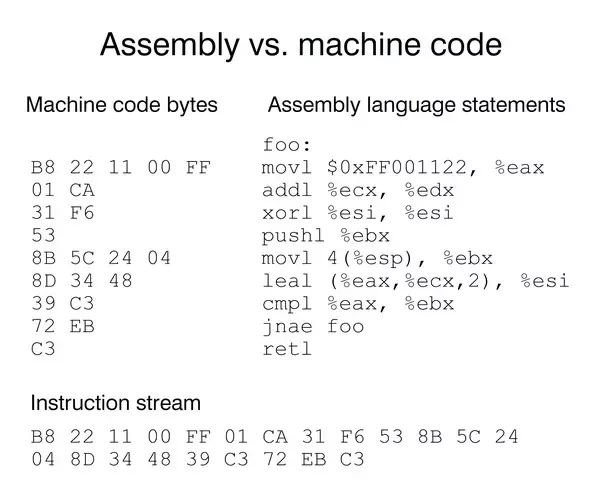

# Program

Gondolom tapasztaltad már, hogy ha valamit bekapcsolsz (laptopot, telefont, TV-t, ...) akkor egy előre megírt program sorozatot (vagy ha úgy tetszik kódot)
futtatsz? Ha nézed ezt az oldalt gondoltad volna, hogy a böngésző értelmezi azt a jel halmazt, amit te is meg tudsz tekinteni? Minden, amiben áram fut és
valamilyen formában processzort (chipet) tartalmaz, azt mind-mind ember tervezte, fejlesztette és írtak rá valamilyen működést. Ez a működés hozza létre azt az
interakciót, hogy olvashatod e sorokat.

A programozás nem szól másról, mint valamilyen probléma megoldásáról vagy egy adott feladat végrehajtásról.

Egy eszköz önmagában nem tudja, hogy hogyan kezeljen egy szituációt vagy hogyan hajtson végre egy szituációt. Azt meg pláne, hogy hogyan adja tudatunkra. Ennek
meghatározásához a gép nyelvén lépésről lépésre kell megadni az utasításokat valamilyen kód formában és az adott szigorú nyelvtana (szintaxisa) szerint.

A fejlesztő vagy programozó, az a személy, aki ezt a problémát megoldja kód formájában. Így elegendő egyszer megvalósítani (implementálni).

Milyen problémák lehetnek, amik szembe jöhetnek?

- Ha azt szeretnéd, hogy a légkondicionáló akkor kapcsoljon be, ha páratartalom elér egy adott szintet, amit maga a termék nem támogat
- Okos otthon-t akarsz építeni, tegyük fel ingyenes [Home Assistant](https://www.home-assistant.io/) OpenSource rendszerrel
- De számos vállalat fizet azért, hogy az ők problémáikkal foglalkozz

## Programozás
Azt kell, hogy mondjam, hogy minden elektronikával működő eszköz és azok komponensei nem úgy kommunikálnak, mint mi emberek. Hanem számos (nevezzük) ér párral
kapcsolódnak egymáshoz. Gondolom láttál már ilyet.

Tegyük fel, egy szobában tartózkodsz, gondolom rendelkezel egy lámpával. Jobb esetben a kapcsoló két állású, ami azt eredményezi, hogy van áram, amitől a
lámpa világítani fog és a másik állásban pedig megszünteted azt. A programozás során is hasonló történik a motorháztető alatt, de ezeket elrejti a [CPU
utasítás készlete](https://hu.wikipedia.org/wiki/Utas%C3%ADt%C3%A1sk%C3%A9szlet).

Tehát a legalacsonyabb programozási módszer, amikor közvetlenül tudnád a processzort utasítani, az a gépi kód (ábrán: Machine code). Már magában ezt értelmezni
is horror. Ezért alkották meg a gépi kódnak a szimbolikus formáját, az [Assembly](https://hu.wikipedia.org/wiki/Assembly-ként)-t és persze ebből is van több
fajta, de a célja azonos. Ha képnél maradunk, akkor a `movl $0xFF00112233, %eax` utasítás a gépi kódban a mellette lévő hexadecimálisnak felel meg,
azaz `B8 22 11 00 FF`. Ha ez kínai, ne ijedj meg, mert erre úgy se lesz szükséged majd. Csak megemlítettem, hogy lásd milyen viharok tombolnak majd legalul,
amitől te távol leszel. _(Kivéve, ha ez a téma érdekel persze.)_ Legyen annyi elég, hogy `A-t mozgatod B-be`-t jelent.

## Magas szintű programozási nyelvek
