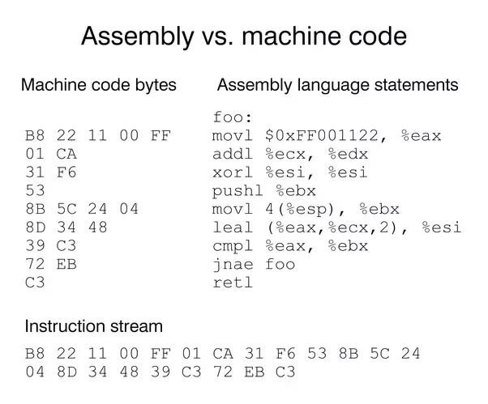

# Program

Gondolom tapasztaltad már, hogy ha valamit bekapcsolsz (laptopot, telefont, TV-t, ...) akkor egy előre megírt program sorozatot - vagy ha úgy tetszik kódot - futtatsz? Ha nézed ezt az oldalt gondoltad volna, hogy a böngésző értelmezi azt az adathalmazt, amit te is meg tudsz tekinteni? Minden, amiben áram fut és valamilyen formában processzort (chipet) tartalmaz, azt mind-mind ember tervezte, fejlesztette és írtak rá valamilyen működést. Ez a működés hozza létre azt az interakciót, hogy kommunikálni tudjunk az eszközzel vagy legalább is jelzést adjon számunkra.

A programozás nem szól másról, mint valamilyen probléma megoldásáról vagy egy adott feladat végrehajtásról.

Egy eszköz önmagában nem tudja, hogy hogyan kezeljen egy helyzetet vagy hogyan és mit hajtson végre egy szituációban. Azt meg pláne, hogy hogyan adja tudtunkra. Ennek meghatározásához a gép nyelvén lépésről lépésre kell megadni az utasításokat valamilyen kód formában és az adott szigorú nyelvtana (szintaxisa) szerint.

A fejlesztő vagy programozó, az a személy, aki ezt a problémát megoldja kód formájában. Mondhatjuk azt is, hogy tolmács szerepet játszik az _igény_ és a _gép_ között. Mivel egy ilyen megoldás újra hasznosítható, így elegendő egyszer megvalósítani (implementálni).

Milyen problémák lehetnek, amik szembe jöhetnek?

- Ha azt szeretnéd, hogy a TV akkor kapcsoljon be, ha páratartalom elér egy adott szintet, amit maga a termék nem támogat
- Okos otthon-t akarsz építeni, tegyük fel ingyenes [Home Assistant](https://www.home-assistant.io/) OpenSource rendszerrel

Ezek megoldása avagy tolmácsolását úgy hívjuk, hogy **programozása**. Az elnevezés ismerős lehet, mikor nyaralás során jelentkezel egy "programra" vagy "programot szervezel", hogy mikor hova szeretnétek elmenni vagy valamit megnézni. Azt is felépíted, megtervezed. A **programozással** sincs másképp, csak a környezet más és a megoldandó feladat.

## Programozás
Azt kell, hogy mondjam, hogy minden elektronikával működő eszköz és azok komponensei nem úgy kommunikálnak, mint mi emberek. Hanem számos (nevezzük) ér párral kapcsolódnak egymáshoz. Gondolom láttál már ilyet.


[//]: # (TODO: Írni majd CPU ról valamikor valahol)
Tegyük fel, egy szobában tartózkodsz, gondolom rendelkezel egy lámpával. Jobb esetben a kapcsoló két állású, ami azt eredményezi, hogy ha van áram akkor a lámpa világítani fog és a másik állásban pedig megszünteted azt. A programozás során is hasonló történik a motorháztető alatt, de sokkalta bonyolultabban és rendkívül gyorsabban. Ezeket a működéseket elrejti a [CPU utasítás készlete](https://hu.wikipedia.org/wiki/Utas%C3%ADt%C3%A1sk%C3%A9szlet).

> [!INFO] Megjegyzés
> A CPU működéséről és felépítéséről RENGETEG információt találsz neten videó, egyetemi anyag vagy jegyzet formájában. Majd írok erről is, de részletekre most nincs szükség.

## Programozási nyelv szintek

### Alacsony szintű programozási nyelvek
Az alacsony szintű programozási nyelvek közé tartozik a gépi kód és az Assembly nyelv, amelyek sokkal közelebb állnak a számítógép hardveréhez, mint az ember számára könnyen érthető formátumok. Ezek a nyelvek közvetlenül a gép számára értelmezhető utasításokat tartalmaznak, ezért gyorsan futnak, de írásuk és megértésük bonyolult.

A legalacsonyabb szintű programozási módszer a gépi kód (Machine code), ahol közvetlenül utasíthatjuk a processzort. Az Assembly nyelvet a gépi kód szimbolikus formáját, hogy egyszerűbb legyen írni és olvasni kulcs szavak és jelzések formájában. Többféle Assembly létezik architektúra és rendszer függvényében, de mindegyik ugyanarra a célt szolgálja.

Engedjétek meg, hogy az alábbi kép példájával éljek, akkor a `movl $0xFF00112233, %eax` Assembly utasítás a mellette lévő hexadecimális (`B8 22 11 00 FF`) formátumnak felel meg a. Ha ez elsőre ez kínai tűnik, ne aggódj – erre nagy valószínűséggel nem lesz szükséged. Csak azért említem, hogy lásd, milyen formában zajlanak a legalacsonyabb szinteken a műveletek, amelyekkel te nem fogsz közvetlenül találkozni. (Hacsak nem érdekel különösebben ez a téma, persze.) Elegendő annyit tudni, hogy ez az utasítás lényegében annyit jelent, hogy `$0xFF00112233` direkt megadott értéket mozgat `movl` a `EAX` regiszterbe, azaz CPU belső "memóriájába".

> [!IMPORTANT] Működési hasonlat
A CPU utasításról-utasításra hajtja ezeket végre és NEM tudja, hogy mit kell velük késöbb tenni és nem is emlékszik, hogy eddig mit csinált. Csak annyi információja van, amit a saját regisztereibe tett bele. Tehát folyton amnéziás és csak annyira emlékszik amennyi információ a zsebében van, ami nagyon limitált.

> [!WARNING] Nem ellenőrzött tartalom!
> Nem tudom, hogy az alábbi kép helyes-e. Ezt nem ellenőriztem, de a mondanivalóján nem változtat.



### Magas szintű programozási nyelvek
A magas szintű programozási nyelvek skálája óriási. Ezek a nyelvek jobban absztaktálják (elrejtik) a számítógép _(de ide értünk minden más elektronikus eszközt is)_ hardverének működését, és inkább az emberi logikára koncentrálódik. Az ilyen nyelvek szintaxisa (nyelvezete) közelebb áll az ember által könnyebben megtanulható nyelvhez, így könnyebb megtanulni és megérteni is.

Az alábbi példa egy `C` magas szintű nyelvvel határozza meg az utasításokat, addig jobb oldalon annak Assembly-re fordított képét látjátok. Persze az Assembly-t se tudja még a gép futtatni, mert ez még csak a "szimbolizált" alakja a gépi kódnak. Ezt még le kell fordítani tényleges gépi kódra, ami már meg tud rágni a masina.

> [!INFO]
> Ezt a fordítást a magas nyelvek megoldják, így neked csak a lényegre kell majd figyelned.

**C nyelven egy példa**
```c
int main() {
    bool a = true;
    int c = 0;

    if (a) {
        c = 2;
    }

    return 0;
}
```

**Assembly nyelven a fenti kód lefordítása.**
```assembly
main:
        push    rbp
        mov     rbp, rsp
        mov     BYTE PTR [rbp-1], 1
        mov     DWORD PTR [rbp-8], 0
        cmp     BYTE PTR [rbp-1], 0
        je      .L2
        mov     DWORD PTR [rbp-8], 2
.L2:
        mov     eax, 0
        pop     rbp
        ret
```


#### Mi is ez?
Jelenleg ez egy értelmetlen program. :') Így, ha gondolod ugord át nyugodtan ezt a magyarázatot, mert később úgy is elmagyarázom rész komponensenként.

De ha érdekel:

```c:line-numbers{1,9,10}
int main() {
    bool a = true;
    int c = 0;

    if (a) {
        c = 2;
    }

    return 0;
}
```

A `main()` egy bejárai ajtó, azaz innen kezdőik a program futás. Sok nyelv `main()`-el kezd, pl: Java, C, C++, C#, Go, ... Más nyelv a megadott fájl első sorától. Ilyen például a Python, PHP vagy a JavaScript. Ami a `main()` előtt van `int` az a integer, mint típus. Most legyen annyi elég, hogy egy pozitív vagy negatív természetes számról van szó,  mint pl: `-431`, `33`. Ezt az értéket majd az operációs rendszer fogja értelmezni, hogy sikeresen lefutott a program vagy hiba lépett fel. Ezt a függvény vissza tudja adni a `return`-al.

Mi az a _"vissza ad"_? Ismerős a `sin(90) = 1` matematikai kifejezés? Ha beírod a számológépbe, hogy `sin(90)` akkor az eredmény az amit vissza ad. Tehát, a `main()` futás eredményét adja vissza, amit `return`-al határozunk meg, hogy mi legyen az. Jelen példában bele van "égetve" a `0`.

```c:line-numbers{2-3}
int main() {
    bool a = true;
    int c = 0;

    if (a) {
        c = 2;
    }

    return 0;
}
```

Megnevezünk egy `a` helyet a memóriában és bele teszek egy `true` (igaz) értéket. Majd egy számot `c` néven és bele teszem a `0`-t. Vagy értelmezheted úgy is, hogy _`a` legyen egyenlő igazzal_ és _`c` legyen egyenlő `0`-val_.

```c:line-numbers{5-7}
int main() {
    bool a = true;
    int c = 0;

    if (a) {
        c = 2;
    }

    return 0;
}
```

Az `if` nem más, mint a magyar `ha`. Ha a feltétel igaz, akkor a `{ }` közötti rész lefut. De mivel az `a` igaz, ezért lefut, mert azt adtuk meg, hogy `if (a)`. Így a c értékét, ami most `0`, felül írjuk `2`-vel, vagy legyen a `c` egyenlő `2`-vel.

Ugye, hogy sokkalta jobban olvasható, mint ez? :)

```assembly
main:
        push    rbp
        mov     rbp, rsp
        mov     BYTE PTR [rbp-1], 1
        mov     DWORD PTR [rbp-8], 0
        cmp     BYTE PTR [rbp-1], 0
        je      .L2
        mov     DWORD PTR [rbp-8], 2
.L2:
        mov     eax, 0
        pop     rbp
        ret
```
