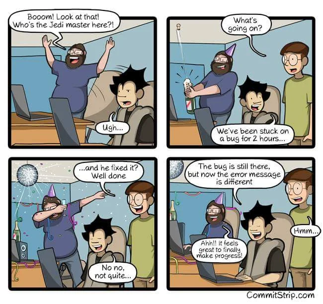

# Nehéz szakma

Az informatika világa folyamatosan változik, ezért nélkülözhetetlen, hogy az IT szakemberek naprakészek maradjanak a legújabb technológiában és módszertanokban.
Ez azonban nem mindig egyszerű.

Másik nehézség, hogy az informatikában a géppel "kommunikálni" nem olyan egyszerű, mint egy emberrel. A gép csak is kizárólag azt csinálja, amire utasítjuk.
Ezért előfordul az, hogy úgy hisszük, hogy jól csináltunk valamit, de még se az elvárt eredményt kapjuk egy elírás miatt vagy valamit kifelejtettünk a
folyamatból. Ennek a problémának a megtalálása egy nagy projekt esetén akár több napba is telhet. Nem is véletlen, hogy az IT tele van mémekkel.

Magyarosan lefordítva:
> - Bumm! Nézd csak! Ki a Jedi mester itt!?
> - Uhh...
> - Mi folyik itt?
> - Két órája egy hibán dolgozunk...
> - ...és ő megoldotta? Szép munka.
> - Nem nem, nem egészen.
> - Még mindig hibás, de most már más a hiba üzenet.
> - Ahh!! Olyan jó érzés végre haladni.
> - Hmm.

## Merj hibázni!

Még a legtapasztaltabb szakemberekkel is előfordulhat, hogy egy félre értés vagy egy figyelmetlenség miatt hibát követnek el, és hosszú ideig nem mutatja meg
magát akár évekig. Ennek kiküszöbölése érdekében fejlesztési folyamatokat definiálnak, hogy minél több emberen menjen át a termék vagy aminek éppen kell (
konfiguráció, kód, ...), annál kisebb a valószínűsége - de sose 0% -, hogy átcsusszan valamilyen hiba. Aztán mégis megesik, hogy földbe áll egy szerver vagy
a fél világ, mint a [CrowdStrike](https://telex.hu/kulfold/2024/07/19/informatikai-leallas-kieses-legitarsasag-bank-media-microsoft) esetében. Nagy a skála. Ha
valami még is átcsusszan, az mindenkin múlott, aki a folyamatban részt vett. **Sose egy szereplős!** _(Jó... Kivéve, ha egyedül dolgozol, mert akkor te vagy az
egyetlen szereplő.)_

Ha pedig új dolgot tanulsz, akkor az elején sok hibát fogsz elkövetni. Ez teljesen normális. Az informatika egy olyan szakma, ahol a hibák elkerülhetetlenek. Ez
nem műtő asztal, ahol, ha orvos hibát vét veszik is elő műhibáért. Itt, ha látod, hogy valami nem megy legrosszabb esetben is tovább kísérletezel. Én
a több éves tapasztalatommal is olyan balfasz vak tudok lenni, hogy egy egyszerű elírást nem veszek észre. Legutóbb, mikor ezt az oldalt akartam automatizálni,
hogy automatikusan kitegye az új verziót, folyton elhalt a folyamat. Aztán kiderült, hogy a rossz mappára hivatkoztam. El is ment vele 3-4 óra...

Tehát:

> "Minél többszőr futsz be abba a bizonyos fasz-erdőbe, annál jobban fogod ismerni azt, hogy hogyan kell azt csinálni vagy megoldani."

> [!IMPORTANT] Fontos!
> Merj hibázni és tanulj belőle!

> [!CAUTION] Vigyázz a jogi következményekre
> Persze a szándékos károkozás már más tészta. Azért azt ne gyakorold.

## Ami előre vissz
Az informatika iránti **szenvedély** az egyik legerősebb motiváló tényező. Ha őszintén **érdekelnek** a technológiai újdonságok és az IT megoldások
működése, az önmagában is elég lehet ahhoz, hogy napról napra lelkesedéssel merülj el benne. Amikor egy konkrét **problémát szeretnél megoldani**, vagy **van
egy célod**, amit el akarsz érni, az is erős hajtó erő tud lenni. Az ilyen kihívások ösztönözhetnek arra, hogy mélyebben elmerülj az adott
technológiákban vagy módszertanokban, és felfedezd a szükséges megoldásokat.

Sajnos azt kell mondjam, ha azért tanulod ezt a szakmát, mert csak "jól fizet", akkor sajnos nem fogod élvezni. Gyorsan fogod várni az eredményt, de a sorozatos
hibák során elfogod veszíteni az érdeklődésed és le fogod tenni. Persze fellángolások lehetnek, de ezt a szakmát szerelemből vagy érdeklődésből lehet csinálni.

### Ha nincs motivációd?

Az okozati lánc: `Inspiráció -> Motiváció -> Cselekvés`.

Az inspiráció az, ami elindít, a motiváció az, ami folyamatban tart, a cselekvés az, ami elvezet a célhoz. DE! Ez egy végtelen kör. Az inspiráció és a motiváció
folyamatosan változik, ezért a cselekvés is változni fog. Az inspiráció és a motiváció nem mindig lesz jelen, de cselekvéssel is berugható a kör. Tehát ha nincs
motivációd, akkor csak kezdj el valamit csinálni.

Bontsuk fel a kört így: `Cselekvés -> Inspiráció -> Motiváció`

## Ne es ebbe a hibába!
Ez nem csak az informatikai szakmára igaz, hanem az élet minden területére. Szerintem beteszek ide egy
[wiki linket](https://hu.wikipedia.org/wiki/Dunning%E2%80%93Kruger-hat%C3%A1s), [YouTube videót](https://www.youtube.com/watch?v=iZhvjvXopAE) és
egy [YouTube Short](https://www.youtube.com/shorts/a1hqK9B0t6w)-ot, ami e témát feszegeti.
